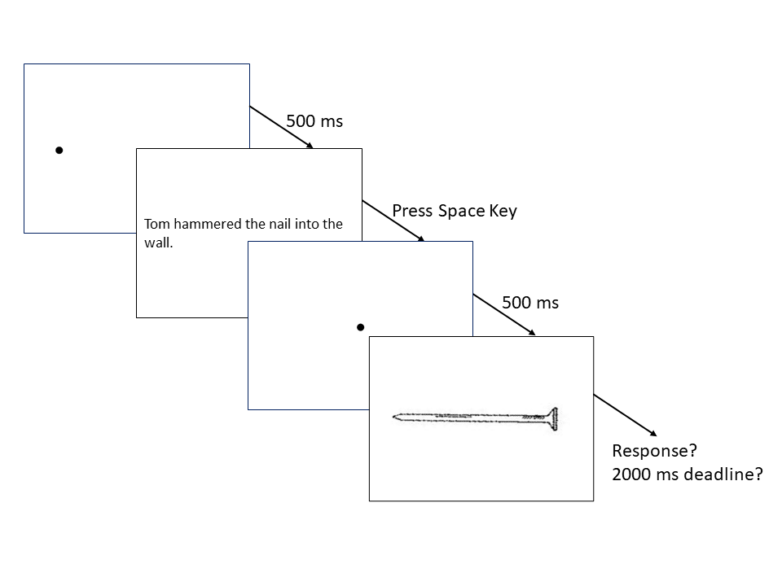

(ref:abstract) Mental simulation theories of language comprehension propose that people automatically create mental representations of objects mentioned in sentences. Representation is often measured with the sentence-picture verification task, in which participants first read a sentence and, on a following screen, see a picture of an object. Participants then verify whether the latter object had been mentioned in the sentence. Crucially, two covert conditions exist: the sentence and the picture can either match or mismatch in terms of a perceptual property, including object orientation, shape, color and size. The key finding obtained in some studies is the match advantage, whereby responses were faster in the match condition; however, object orientation results are often inconsistent inconsistent findings across languages. This registered report describes our investigation of the match advantage of object orientation across 18 languages, which was undertaken by 33 laboratories and organized by the Psychological Science Accelerator. The preregistered analysis revealed that the match advantage was supported either overall or in any specific language. 

```{r setup, include = FALSE}
  knitr::opts_chunk$set(
	echo = FALSE,
	cache = FALSE
)
  library(tidyverse)
  library(data.table)
  library(lubridate)
  library(magrittr)
  library(flextable)
  library(lme4)
  library(lmerTest)
  #library(cAIC4)
  library(parameters)
  library(metafor)
  library(afex)
  library(standardize)
  library(sjPlot)
  library(ggplot2)
  library("kableExtra")
  library("papaja")

## Note for changes:
## The in-text citation can not be rendered. There should be package issues I have yet figured out.

# Import multiple-bytes string in English system
Sys.setlocale("LC_ALL","English") 

## Turn initial letter to upper style.
firstup <- function(x) {
  substr(x, 1, 1) <- toupper(substr(x, 1, 1))
  x
}
```


```{r analysis-preferences}
# Seed for random number generation
set.seed(42)
knitr::opts_chunk$set(cache.extra = knitr::rand_seed)
```


```{r load_info, message=FALSE, warning=FALSE, include=FALSE}
# Load lab information
# https://osf.io/dtfcg
lab_info <-  dir(path = "..",full.names = TRUE, recursive = TRUE, include.dirs = TRUE, pattern = "Lab_info.csv")  %>%
  read_csv()

# https://osf.io/dtfcg
lab_fin <-dir(path = "..",full.names = TRUE, recursive = TRUE, include.dirs = TRUE, pattern = "lab_fin.csv")  %>%
  read_csv()

# Load meta data of in-site data: age, female numbers
# The information is summarized in "Participants".
# https://osf.io/vnbkm
insite_meta <- dir(path = "..",full.names = TRUE, recursive = TRUE, include.dirs = TRUE, pattern = "insite_meta.csv") %>%
  read_csv() 

# Load and summary meta data of online data: age, female numbers, language proficiency
# The information is summarized in "Participants".
# https://osf.io/3kx9r
osweb_meta <- dir(path = "..",full.names = TRUE, recursive = TRUE, include.dirs = TRUE, pattern = "jatos_meta.csv") %>%
  read_csv() %>%
  mutate(gender = ifelse(gender==1,"FEMALE",ifelse(gender==2,"MALE","OTHER"))) %>%
#  mutate(birth_year_tr = as.numeric(birth_year)) %>%
  mutate(birth_year_tr = as.numeric(gsub(birth_year,pattern="NA|x",replacement = ""))) %>%
  mutate(year = ifelse(birth_year_tr > 21 & !is.na(birth_year_tr), 1900 + birth_year_tr, 2000 + birth_year_tr)) %>%
  mutate(age = ifelse(!is.na(year),2021-year,NA)) %>%
  group_by(Batch) %>%
  summarise(N = n(), Female_N = sum(gender=="FEMALE",na.rm = TRUE), Age = mean(age, na.rm=TRUE), Proficiency = mean(lang_prof))

## count how many lab collected the data
all_lab_ID = unique(c(insite_meta$PSA_ID,osweb_meta$Batch))
lab_len = length(all_lab_ID) - 3 ## minus three additional Lab ID for non-native participants and Serbian subgroup.
```


# Introduction

Mental simulation of object properties is a major topic in conceptual processing research [@ostarekSixChallengesEmbodiment2019; @scorolli2014embodiment]. Theoretical frameworks of conceptual processing demonstrate the integration of linguistic representations and situated simulation [e.g., @barsalou_grounded_2008; @zwaan_embodiment_2014]. Proponents of situated cognition assume that perceptual representations are able to be generated during language processing. Recently, some neuroimaging studies are testing this hypothesis on the cortical activation patterns from seeing visual images and reading text [see the summary of @ostarekSixChallengesEmbodiment2019, p. 596].

One empirical index of situated simulation is the mental simulation effects measured in sentence-picture verification (see Figure \@ref(fig:fig01)). This task requires participants to read a probe sentence displayed on the screen. On the following screen, the participants see a picture of an object and must verify whether the object was mentioned in the probe sentence. Response times to the pictures are summarized as the mental simulation effects, which occurs when people are faster to verify pictured objects whose properties match those of objects implied in the probe sentences. Mental simulation effects have been demonstrated for object shape [@zwaanLanguageComprehendersMentally2002], color [@connellRepresentingObjectColour2007], and orientation [@stanfield_effect_2001]. Subsequent replication studies revealed consistent results for the shape but inconsistent findings for the color and orientation effects [@koning_mental_2017; @rommersObjectShapeOrientation2013; @zwaanRevisitingMentalSimulation2012], and the theoretical frameworks do not provide researchers much guidance regarding the potential causes for this discrepancy. With the accumulating concerns about the lack of reproducibility, researchers have found it challenging to update the theoretical framework in terms of mental simulation effects being unreplicable [e.g., @kaschakEmbodimentLabTheory2021]. Researchers who intended to improve the theoretical framework necessarily require a reproducible protocol for measuring the mental simulation effects. 


(Insert Figure \@ref(fig:fig01) about here)


```{r fig01, echo=FALSE, message=FALSE, warning=FALSE, results='asis', paged.print=TRUE, fig.cap="Procedure of sentence-picture verification task."}


## Note for changes:
## Add this procedure plot in terms of Mahmoud's suggestion.
```

An additional facet of this research is the linguistic representations of object properties may play a role in the unreliability of the mental simulation effect. Mental simulation effects for object shape have consistently appeared in English [@zwaanEmbodiedSentenceComprehension2005; @zwaanParticipantNonnaiveteReproducibility2017; @zwaanRevisitingMentalSimulation2012], Chinese [@liERPStudyMental2017], Dutch [@engelenPerceptualSimulationDeveloping2011; @koning_mental_2017; @pecherLanguageComprehendersRetain2009; @rommersObjectShapeOrientation2013], German [@kosterMentalSimulationObject2018], Croatian [@seticNumericalCongruencyEffect2017], and Japanese [@satoOneWordTime2013]. Object orientation, on the other hand, has produced mixed results across languages [@chenDoesObjectSize2020; @koning_mental_2017; @kosterMentalSimulationObject2018; @zwaanEmbodiedSentenceComprehension2005; @zwaanRevisitingMentalSimulation2012]. Among the studies of shape and orientation, the results indicated smaller effect sizes of object orientation than that of object shape (e.g., d = 0.10 vs. 0.17; in Zwaan and Pecher, 2012; 0.07 vs. 0.27 in de Koning et al., 2017). To understand the causes for the discrepancies among object properties and languages, it is imperative to consider the cross-linguistic and experimental factors of the sentence-picture verification task.

## Cross-linguistic, Methodological, and Cognitive Factors 

Several factors might contribute to cross-linguistic differences in the match advantage of orientation, and we focused on context, methodological, and cognitive factors. Researchers have argued that languages differ in how they encode motion and placement events in sentences [@newmanCrosslinguisticOverviewPosture2002; @verkerkEvolutionaryDynamicsMotion2014]. In addition, the potential role of mental rotation as a confound has been considered [@rommersObjectShapeOrientation2013]. We expand on how the context, experimental, and cognitive factors hinder the improvement of theoretical frameworks as below. 

**Context Factors.** The probe sentences used in object orientation studies usually contain several motion events (e.g., “The ant walked towards the pot of honey and tried to climb in.”). The languages we probed in this study encode motion events in different ways, and grammatical differences between them could explain the different match advantage results. According to @verkerkEvolutionaryDynamicsMotion2014, Germanic languages (e.g., Dutch, English, German) generally encode the manner of motion in the verb (e.g., ‘The ant dashed’), while conveying the path information through satellite adjuncts (e.g., ‘towards the pot of honey’). In contrast, other languages, such as the Romance family (e.g., Portuguese, Spanish) more often encode path in the verb (e.g., ‘crossing,’ ‘exiting’). Crucially, the past research on the match advantage of object orientation is exclusively based on Germanic languages, and yet, there were differences across those languages, with English being the only one that consistently yielded the match advantage. As a minor difference across Germanic languages in this regard, Verkerk notes that path-only constructions (e.g., ‘The ant went to the feast’) are more common in English than in other Germanic languages. 

Another topic to be considered is the lexical encoding of placement in each language, as the stimuli contains several placement events (e.g., ‘Sara situated the expensive plate on its holder on the shelf.’). @chenDoesObjectSize2020 and @kosterMentalSimulationObject2018 noted that some Germanic languages, such as German and Dutch, often make the orientation of objects more explicit than English. Whereas in English readers could use the verb “put” in both “She put the book on the table” and “She put the bottle on the table,” in both Dutch and German, readers could instead say “She laid the book on the table,” and “She stood the bottle on the table.” In these literal translations from German and Dutch, the verb “lay” encodes a horizontal orientation, whereas the verb “stand” encodes a vertical orientation. This distinction extends to verbs indicating existence. As @newmanCrosslinguisticOverviewPosture2002 exemplified, an English speaker would be likely to say “There’s a lamp in the corner,” whereas a Dutch speaker would be more likely to say “There ‘stands’ a lamp in the corner.” Nonetheless, we cannot conclude that these cross-linguistic differences are affecting the match advantage across languages because the current theories [e.g.,  language and situated simulation, @barsalou_grounded_2008] do not  precisely define the complexity of linguistic aspects such as placement events. 

**Methodological  factors.** Inconsistent findings on the match advantage of object orientation generated the debates about the reliable task design, such as in the studies failing to detect the match advantage participants not being required to verify the probe sentences they had read [see @zwaan_embodiment_2014]. Without such a verification, participants might have paid less attention to the meaning of the probe sentences, in which they would have been less likely to form a mental representation of the objects [e.g., @zwaanReadersConstructSpatial1993]. In this regard, it is relevant to acknowledge that variability originating from individual differences and other characteristics of experiments can substantially influence the results [@barsalouEstablishingGeneralizableMechanisms2019; @kaschakEmbodimentLabTheory2021].


**Cognitive Factors.** Since the first study showed a match advantage of object orientation [@stanfield_effect_2001], later studies on this topic have examined the association between the match advantage and alternative cognitive mechanisms rather than the situated simulation. Spatial cognition is one of the potential cognitive mechanisms, which may be measured with mental rotation tasks. Studies have suggested that mental rotation tasks offer valid reflections of previous spatial experience [@frickMentalObjectRotation2013] and of current spatial cognition [@chuSpontaneousGesturesMental2008; @pouwMoreEmbeddedExtended2014]. @koning_mental_2017 suggested that effectiveness of mental rotation could increase with the object size then facilitate the processing to replace the mismatched orientation described in the sentence. @chenDoesObjectSize2020 examined this implication in use of the picture-picture verification task that was designed using the mental rotation paradigm [@cohenMentalRotationMental1993]. In each trial of this task, two pictures appear on opposite sides of the screen. Participants had to verify whether the pictures represent identical or different objects. This study not only indicated the shorter verification times for the same orientation (i.e., two identical pictures presented in horizontal or vertical orientation) but also showed the larger time difference for the large size object (i.e., pictures are bridges versus pictures are pens). The results patterns are consistent among their investigated languages: English, Dutch, and Chinese. In comparison with the results of sentence-picture verification and picture-picture verification, -@chenDoesObjectSize2020 revealed the plausible hypothesis that mental rotation may affect the comprehension in some languages whereas in others. This study converted the picture-picture verification times to the mental rotation scores that were the discrepancy of verification times between the identical and different orientation[^1]. With this measurement, we explore the relation of mental rotation in spatial cognition and orientation effect in comprehension across the investigated languages.


[^1]: In the preregistered plan, we used the term "imagery score" but many collaborators hardly realized what the measurement refers to. Therefore, we used "mental rotation scores" instead of "imagery scores" in the final report. 


## Purposes of this study

To scrutinize the discrepancies of object orientation effects across languages and cognitive factors, we examined the reproducibility of this effect. In this multi-lab collaboration, our preregistered plan aimed at detecting a general match advantage of object orientation across languages and evaluated the magnitude of match advantage in each specific language. Additionally, we examined if match advantages were related to the mental rotation index. Thus, this study followed the original methods from @stanfield_effect_2001 and addressed two primary questions: (1) How much of the match advantage of object orientation can be obtained within different languages and (2) How do differences in the mental rotation index affect the match advantage across languages? 


# Method

## Hypotheses and Design

The study design for the sentence-picture and picture-picture verification task was mixed using between-participant (language) and within-participant (match versus mismatch object orientation) independent variables. In the sentence-picture verification task, the match condition reflects a matching between the sentence and the picture, whereas in the picture-picture verification, it reflects a match in orientation between two pictures. The only dependent variable for both tasks was response time. The time difference between conditions in each task are the measurement of orientation effects and mental rotation scores. We did not select languages systematically, but instead based on our collaboration recruitment with the Psychological Science Accelerator [PSA, @moshontzPsychologicalScienceAccelerator2018].


(1) In the sentence-picture verification task, we expected response time to be shorter for matching compared to mismatching orientations within each language. In the picture-picture verification task, we expected shorter response time for identical orientation compared to different orientations. We did not have any specific hypotheses about the relative size of the object orientation match advantage in different languages.

(2) Based on the assumption that the mental rotation is a general cognitive aspect, we expect equal mental rotation scores across languages but no association with mental simulation effects [see @chenDoesObjectSize2020].


```{r all_data, message=FALSE, warning=FALSE, include=FALSE}
# Load raw SPV data 
# Build data frame of valid SP verification responses
# https://osf.io/xzwc4
SP_V <-  dir(path = "..",
      pattern = "all_rawdata_SP_V",   ## include in-site and internet data
      recursive = TRUE, full.names = TRUE) %>% 
      read_csv() %>%
      inner_join(select(lab_info, PSA_ID, Language), by = "PSA_ID") %>%
    distinct() %>% ## Merge the language aspects
    mutate(Language = ifelse(Language == "Magyar", "Hungarian", Language)) %>%  ## Switch "Magyar" to "Hungrian"
    mutate(Language = ifelse(Language == "Simple Chinese", "Simplified Chinese", Language)) %>%  ## Switch "Simple Chinese" to "Simplified Chinese"
    filter(PSA_ID != "TUR_007E" & PSA_ID != "TWN_002E") %>% ## Exclude the data of non-native participants
    mutate(PSA_ID = str_replace(PSA_ID, "SRB_002B", "SRB_002")) %>% ## Combine two Serbian language groups based on the collectors' recommendation
    mutate(Source = if_else(opensesame_codename == "osweb","osweb","site"), 
           Subject = paste0(Source,"_",PSA_ID,"_",subject_nr)) %>% ## Compose the unique participant id
    subset(Match != "F") ## Exclude fillers in SP_V

## Data cleanup
### Fix repeated id in CAN_020
datetime_CAN = SP_V %>% subset(Subject == "site_CAN_020_1") %>% pull(datetime) %>% unique()

SP_V[SP_V$Subject == "site_CAN_020_1"& SP_V$datetime == datetime_CAN[1],]$Subject = rep("site_CAN_020_1a",24) ## This participant did not finish SP and PP tasks.

SP_V = SP_V %>% filter(Subject != "site_CAN_020_1a") ## Erase this participant

#SP_V[SP_V$Subject == "site_CAN_020_1"& SP_V$datetime != datetime_CAN[1],]$Subject = rep("site_CAN_020_1",24)

### Fix repeated items
SP_V = SP_V %>% filter(!row_number() %in% c(
#### Locate the row number of repeated items in PSA_002
which(SP_V$Subject == "osweb_PSA_002_587")[SP_V %>% subset(Subject == "osweb_PSA_002_587") %>% pull(Target) %>% duplicated() %>% which(TRUE)],
#### Locate the row number of repeated items in POL_001
which(SP_V$Subject == "site_POL_001_36")[SP_V %>% subset(Subject == "site_POL_001_36") %>% pull(Target) %>% duplicated() %>% which(TRUE)])
) 


## Data Exclusions: Participant Level 
## Stat information for Participants and Intra-lab analysis sections
Raw_total <- SP_V %>%
    group_by(Language, PSA_ID, Subject) %>%
    summarise(Excluded = sum(Acc_bound == TRUE), source = sum(opensesame_codename == "osweb")) %>% ## summation of the excluded participants and the participants from Internet.
    group_by(Language, PSA_ID) %>%
    summarise(N = n(), N_excluded = sum(Excluded == 24), N_web = sum(source == 24)) 

# Build data frame of valid PP responses
# https://osf.io/ym7j3
PP <- dir(path = "..",
      pattern = "all_rawdata_PP", 
      recursive = TRUE, full.names = TRUE) %>% 
      read_csv() %>%
      inner_join(select(lab_info, PSA_ID, Language), by = "PSA_ID") %>%
    distinct() %>% ## Merge the language aspects
    mutate(Language = ifelse(Language == "Magyar", "Hungarian", Language)) %>%  ## Switch "Magyar" to "Hungrian"
    mutate(Language = ifelse(Language == "Simple Chinese", "Simplified Chinese", Language)) %>%  ## Switch "Simple Chinese" to "Simplified Chinese"
    filter(PSA_ID != "TUR_007E" & PSA_ID != "TWN_002E") %>% ## Exclude the data of non-native participants
    mutate(PSA_ID = str_replace(PSA_ID, "SRB_002B", "SRB_002")) %>% ## Combine two Serbian language groups based on the collectors' recommendation
    mutate(Source = if_else(opensesame_codename == "osweb","osweb","site"), 
           Subject = paste0(Source,"_",PSA_ID,"_",subject_nr)) ## Compose the unique participant id

## Add SPV info to PP
## Compute participants' accuracy and exclude fillers
PP <- PP %>% left_join(
  select(SP_V, PSA_ID, subject_nr, Acc_bound) %>% group_by(PSA_ID, subject_nr) %>% 
    summarise(SPV_bound = (sum(Acc_bound)==48) )  ## Exclude the participants contributed low accuracy in SPV
  , by=c("PSA_ID","subject_nr")) %>% ## insert the low SP_V acc marks
  filter(Identical != "F") 

PP %>% subset(Subject == "site_CAN_020_1") %>% pull(datetime) %>% unique()

## Data cleanup
### Because of the mistakes in osweb script, some participants' postsurvey records were included.
### Locate the repeated rows
excluded_rows <- NULL
for(id in (PP %>% group_by(Subject) %>%
  summarise(trial_N = n()) %>%
  filter(trial_N >24) %>%
  pull(Subject) ) ){
  excluded_rows = c(excluded_rows,which(PP$Subject == id)[25:length(which(PP$Subject == id))])
}
### exclude the repeated data rows 
PP = PP %>% filter(
!row_number(PP$Subject) %in% excluded_rows
)

# Load SP memory responses
# https://osf.io/zk4aj
SP_M <- dir(path = "..",
      pattern = "all_rawdata_SP_M", 
      recursive = TRUE, full.names = TRUE) %>% 
      read_csv()  %>%    
      # subset(correct == 1) %>%  ## Exclude the incorrect responses and filler trials
      inner_join(select(lab_info, PSA_ID, Language), by = "PSA_ID") %>%
    distinct() %>% ## Merge the language aspects
    mutate(Language = ifelse(Language == "Magyar", "Hungarian", Language)) %>%  ## Switch "Magyar" to "Hungrian"
    mutate(Language = ifelse(Language == "Simple Chinese", "Simplified Chinese", Language)) %>%  ## Switch "Simple Chinese" to "Simplified Chinese"
    filter(PSA_ID != "TUR_007E" & PSA_ID != "TWN_002E") %>% ## Exclude the data of non-native participants
    mutate(PSA_ID = str_replace(PSA_ID, "SRB_002B", "SRB_002")) %>%  ## Combine two Serbian language groups based on the collectors' recommendation
    mutate(Source = if_else(opensesame_codename == "osweb","osweb","site"), 
           Subject = paste0(Source,"_",PSA_ID,"_",subject_nr)) ## Compose the unique participant id


## Data cleanup
### Fix repeated id in CAN_020
datetime_CAN = SP_M %>% subset(Subject == "site_CAN_020_1") %>% pull(datetime) %>% unique()


SP_M[SP_M$Subject == "site_CAN_020_1"& SP_M$datetime == datetime_CAN[1],]$Subject = "site_CAN_020_1a"  ## This participant did not finish SP and PP.

SP_M = SP_M %>% filter(Subject != "site_CAN_020_1a") ## Erase this participant


#SP_M[SP_M$Subject == "site_CAN_020_1"& SP_M$datetime != datetime_CAN[1],]$Subject = "site_CAN_020_1"

## Note for changes:
## During Feb to May, I was testing the ways to integrate old and new outlier criterion. The tests were settled in the May update. In this Rmd file, R chunks for checking data content are erased. 

```

## Participants

The preregistered power analysis indicated n = 156 to 620 participants for 80% power for a directional one-sample t-test for a d = 0.20 and 0.10, respectively. A mixed-model simulation suggested that n = 400 participants with 100 items (i.e., 24 planned items nested within at least five languages) would produce 90% power to detect the same effect as @zwaanRevisitingMentalSimulation2012. The laboratories were allowed to follow a secondary plan: a team collected at least their preregistered minimum sample size (suggested 100 to 160 participants, most implemented 50), and then determine whether or not to continue data collection via Bayesian sequential analysis (stopping data collection if $BF_{10}$ = 10 or 1/10)[^2]. 

<!-- Note  --->

[^2]: See details of power analysis in the preregistered plan, p. 13 ~ 15. https://psyarxiv.com/t2pjv/

<!--- Mark the non-native participants exclusion --->

We finally collected data in `r length(unique(Raw_total$Language))` languages from `r length(unique(Raw_total$PSA_ID))` laboratories. Each laboratory chose a maximal sample size and an incremental n for sequential analysis before their data collection. We excluded the non-native participants' data from two laboratories (TUR_007E, TWN_002E) because they were recruited for the institute policies instead of this study plan. Because the preregistered power analysis did not match the final analysis plan, we additionally completed a sensitivity analysis to ensure sample size was adequate to detect small effects, and the results indicated that each effect could be detected at a 2.23 millisecond range for the object orientation effect. Appendix 1 summarizes the details of sensitivity analysis. 

Before the pandemic outbreak, `r format(sum(insite_meta$N), scientific=FALSE, big.mark = ",")` participants (`r format(sum(insite_meta$Female_N), scientific=FALSE, big.mark = ",")` women; M = `r format(mean(insite_meta$Age), scientific=FALSE, big.mark = ",")` years old) from `r sum(Raw_total$N_web == 0)` laboratories joined and finished the study. After the study migrated online, additional `r format(sum(osweb_meta$N), scientific=FALSE, big.mark = ",")` participants (`r format(sum(osweb_meta$Female_N), scientific=FALSE, big.mark = ",")` women; M = `r format(mean(insite_meta$Age), scientific=FALSE, big.mark = ",")` years old) from `r length(unique(osweb_meta$Batch))` laboratories joined this study. Excluded the participants who did not complete the study, `r format(sum(Raw_total$N) - sum(Raw_total$N_web), scientific=FALSE, big.mark = ",")` participants from on-site study and `r format(sum(Raw_total$N_web), scientific=FALSE, big.mark = ",")` participants from online study contributed to the valid data.

In online study participants heard auditory instructions at the beginning and had to correctly answer at least 2 of 3 comprehension check questions about the instructions. 
All participating laboratories had either ethical approval or institutional evaluation before data collection. All data and analysis scripts are available on the source files (https://osf.io/p7avr/). Appendix 2 summarizes the average characteristics by language and laboratory. 

## General Procedure and Materials

In the beginning of the sentence-picture verification task, participants had to correctly answer all the practice trials. Each trial started with a left-justified and horizontally centered fixation point displayed for 1000 ms, immediately followed by the probe sentence. The sentence was presented until the participant pressed the space key, acknowledging that they understood the sentence. Then, the object picture [from @zwaanRevisitingMentalSimulation2012] was presented in the center of the screen until the participant responded otherwise it disappeared after 2 seconds. Participants were instructed to verify that the object on screen was mentioned in the probe sentence as quickly and accurately as they could. Following the original study [@stanfield_effect_2001], a memory check test was carried out after every three to eight trials to ensure that the participants had read each sentence carefully.

The picture-picture verification task used the same object pictures. In each trial, two objects appeared on either side of the central fixation point until either the participant indicated that the pictures displayed the same object or two different objects or until 2 seconds elapsed. In the trials where the same object was displayed, the pictures on each side were presented the same orientation (both were horizontal/vertical) or different orientations (one was horizontal; one was vertical). 

The study was executed using OpenSesame software for millisecond timing [@mathotOpenSesameOpensourceGraphical2012]. After the COVID-19 pandemic broke out, the project team decided to move data collection online. To minimize the differences between on-site and web-based studies, we converted the original Python code to Javascript and collected the data using OpenSesame through a JATOS server [@langeJustAnotherTool2015]. We proceeded with the online study from February to June 2021 after the changes in the procedure were approved by the journal editor and reviewers. Appendix 2 describes the deployment of the scripts and the results of participants’ fluency tests. Following the literature, we did not anticipate any theoretically important differences between the two data collection methods [see @anwyl-irvineGorillaOurMidst2020; @bridgesTimingMegastudyComparing2020a; @deleeuwPsychophysicsWebBrowser2016]. The instructions and experimental scripts are available at the public OSF folder (https://osf.io/e428p/ "Materials" in Files). 


```{r site_SP_V, message=FALSE, warning=FALSE, include=FALSE}
## Data exclusion: summary table
### Part of Table
### Summarize the valid participants' SP verification data
SP_V_subj_site <- SP_V %>%
    filter(Source!="osweb") %>%  # exclude jatos data
    group_by(Subject) %>%
    mutate(acc = sum(correct)/n()) # for average accuracy percentage

## Tidy SP_V data for counting in `count_site`.
SP_V_site_tidy <- SP_V %>% 
  filter(Source!="osweb")  # exclude jatos data
```


```{r site_SP_M, message=FALSE, warning=FALSE, include=FALSE}
## Tidy SP M data is for count checks. The outcomes are not for report.
SP_M_site_tidy <- SP_M %>% 
    filter(Source != "osweb")

## Summarize the valid participants' SP memory data
SP_M_subj_site <- SP_M_site_tidy %>%
  group_by(Language, PSA_ID, Subject) %>% 
#  summarise(M_Acc = n()/11)
  summarise(M_Acc = sum(correct)/n())
```


```{r site_PP, message=FALSE, warning=FALSE, include=FALSE}
## Tidy PP data  is for count checks. The outcomes are for counting total number.
PP_site_tidy <- PP %>% 
    filter(Source!="osweb") 

## Summarize the valid participants' PP verification data
PP_subj_site <- PP_site_tidy %>%
    mutate(Match = (Orientation1 == Orientation2)) %>%
    group_by(Language, PSA_ID, Subject, Match) %>%
#    summarise(P_RT = median(response_time), P_Acc = n()/12) 
    summarise(P_RT = median(response_time), P_Acc = sum(correct)/n()) 
```


```{r count_site, message=FALSE, warning=FALSE, include=FALSE}
## Generate the total numbers based on old preregistered outliers
sum_site <- (SP_V_site_tidy %>% # first part: SP V
  group_by(Language, PSA_ID, Subject) %>%
    summarise(N = n()) %>%
    group_by(Language, PSA_ID) %>%
  summarise(SP_N = n())) %>% #divide by 2 for match/no match 
left_join(
  SP_M_subj_site %>%           # second part: memory check
    group_by(Language, PSA_ID) %>%
    summarise(M_N = n()),
  by = c("Language","PSA_ID")) %>%
left_join(  
(PP_site_tidy %>%     # third part: PP
  group_by(Language, PSA_ID, Subject) %>%
    summarise(N = n()) %>%
  group_by(Language, PSA_ID) %>%
  summarise(PP_N = n())),   #divide by 2 for identical/different orientations 
by=c("Language","PSA_ID")
) 
```


```{r online_SP_V, message=FALSE, warning=FALSE, include=FALSE}
## Tidy SP V data for mixed linear model in `SP-source-lme`. Acc < .70 are included.

SP_V_osweb_tidy <-  SP_V %>%
      filter(Source=="osweb") %>%   # include jatos data
      #subset(correct == 1 & Match != "F") %>%  ## Exclude the incorrect responses and filler trials
    subset(Match != "F") %>% 
    distinct() %>% ## Merge the language aspects
    filter(!(PSA_ID == "USA_033" & subject_nr == 39)) ## exclude this participant who had not complete PP
```


```{r online_SP_M, message=FALSE, warning=FALSE, include=FALSE}
## Tidy SP M data for mixed linear model
SP_M_osweb_tidy <-  SP_M %>%
      filter(Source=="osweb") %>%   # include jatos data
      distinct() %>% ## Merge the language aspects
      filter(!(PSA_ID == "USA_033" & subject_nr == 39)) ## exclude this participant who had not complete PP

## Summarize the valid participants' SP memory data
SP_M_subj_osweb <- SP_M_osweb_tidy %>%
  group_by(Language, PSA_ID, Subject) %>% 
  #group_by(Language, PSA_ID, subject_nr) %>% 
  summarise(M_Acc = sum(correct)/n())
  #summarise(M_Acc = n()/11)
```


```{r online_PP, message=FALSE, warning=FALSE, include=FALSE}
## Tidy PP data for mixed linear model
PP_osweb_tidy <- PP %>%
      filter(Source=="osweb") %>%   # include jatos data
      #subset(correct == 1 & Identical != "F")  %>%  ## Exclude the incorrect responses and filler trials
    subset(Identical != "F") %>% 
    distinct() %>% ## Merge the language aspects
    filter(!(PSA_ID == "USA_033" & subject_nr == 39)) ## exclude this participant who had not complete PP

## Summarize the valid participants' PP verification data
PP_subj_osweb <- PP_osweb_tidy %>%
    mutate(Match = (Orientation1 == Orientation2)) %>%
    group_by(Language, PSA_ID, Subject, Match) %>%
#    summarise(P_RT = median(response_time), P_Acc = n()/12) 
    summarise(P_RT = median(response_time), P_Acc = sum(correct)/n()) 
```

```{r count_online, message=FALSE, warning=FALSE, include=FALSE}
## Compute the participants from labs and from Internet
sum_osweb <- (SP_V_osweb_tidy %>%
  group_by(Language, PSA_ID, Subject) %>%
    summarise(N = n()) %>%
  group_by(Language, PSA_ID) %>%
  summarise(SP_N = n())) %>%
left_join(  
(PP_osweb_tidy %>% 
  group_by(Language, PSA_ID, Subject) %>%
    summarise(N = n()) %>%
  group_by(Language, PSA_ID) %>%
  summarise(PP_N = n())),
by=c("Language","PSA_ID")
) 
```


```{r preparation, message=FALSE, warning=FALSE, include=FALSE}
## Check and combine the onsite data frame and online data frame sharing the same structure
if(sum(names(SP_V_site_tidy) == names(SP_V_osweb_tidy)) == dim(SP_V_site_tidy)[2]){
  SP_V_tidy = bind_rows(SP_V_site_tidy, SP_V_osweb_tidy)
    chunk_msg01 <- c("All columns in SP_V matched")
} else {
  chunk_msg01 <- c("Not all columns in SP_V matched")
}

if(sum(names(PP_site_tidy) == names(PP_osweb_tidy)) == dim(PP_site_tidy)[2]){
  PP_tidy = bind_rows(PP_site_tidy, PP_osweb_tidy)
    chunk_msg02 <- c("All columns in PP matched")
} else {
  chunk_msg02 <- c("Not all columns in PP matched")
}


if(sum(names(SP_M_site_tidy) == names(SP_M_osweb_tidy)) == dim(SP_M_site_tidy)[2]){
  SP_M_tidy = bind_rows(SP_M_site_tidy, SP_M_osweb_tidy)
    chunk_msg03 <- c("All columns in SP_M matched")
} else {
  chunk_msg03 <- c("Not all columns in SP_M matched")
}
```


```{r MAD_outliers}
## Data Exclusions: Trial Level Exclusions

# We will implement a minimum response latency 160
# We will use a 2*MAD criterion to eliminate long response latencies
# SP_V_tidy and PP_tidy has the variable "Outlier" denoted the outlier.
SP_V_tidy <- SP_V_tidy %>% 
  group_by(Subject) %>% 
  mutate(MAD = mad(response_time),
         med = median(response_time),
         Outlier = response_time <= 160 | response_time >= (med + 2*MAD),
         Outlier_low = response_time <= 160,
         Outlier_high = response_time >= (med + 2*MAD) )


PP_tidy <- PP_tidy %>% 
  group_by(Subject) %>% 
  mutate(MAD = mad(response_time),
         med = median(response_time), 
         Outlier = response_time <= 160 | response_time >= (med + 2*MAD)) 


SP_M_tidy <- SP_M_tidy %>% 
  group_by(Subject) %>% 
  mutate(MAD = mad(response_time),
         med = median(response_time)) 

# Integrate this into the outlier analysis table, change out for lmer criterion and say why


```


## Analysis plan


```{r SP-source-lme, message=FALSE, warning=FALSE, include=FALSE}
## Handling different data collection sources

## analysis to decide if the mixed-effect models had to analyze on-site and web-based respectively

## Use the tidy data through `preparation`, `erin_exclude_incorrects` and `erin_outliers`.
## Low-accuracy participants were reserved in this data set.
SP_V_tidy$r_Source = if_else(SP_V_tidy$Source == "site",1,0)


source_cor.lmer <- lmerTest::lmer(
  response_time ~ Match*r_Source + 
    (1|Subject) + 
    (1|PSA_ID) + 
    (r_Source|Language), 
  control = lmerControl(optimizer = "bobyqa",
                        optCtrl = list(maxfun = 1e6)), 
  data = subset(SP_V_tidy, Outlier == FALSE))

## Results showed no difference regardless of inclusion/exclusion of low-accuracy participants.
source_cor_lmer_out <- round(summary(source_cor.lmer)$coefficients["r_Source",],3)

## Note for changes:
## Because we decided to merge the on-site and on-Internet data, the primary reason depended on the mixed-effect model confirmed no difference between the two data sets. I was testing some ways to present this analysis in the manuscript. In the September update I integrated the outliers decided by old preregistered criterion and the outliers decided by MAD criterion. Method section has the code to compute the outliers; Results section has the code that summarised the different outputs. These codes either changed the codes in the following sections included descriptive statistics, meta-analysis, and mixed-effect models. I would added the comments in the corresponding chunks if they are necessary.
```

Our first planned analysis[^3] employed the fixed-effects meta-analysis model that estimated the match advantage across laboratories and languages. The meta-analysis summarized the median reaction times by match condition then determine the effect size by laboratory. For the languages for which at least two teams collected data, we computed the meta-analytical effect size for these language data.

[^3]: See the analysis plan in the preregistered plan, p. 19 ~ 20. https://psyarxiv.com/t2pjv/


The planned mixed-effect models used each individual response time as the dependent variable and analyzed the fixed effects of matching condition. The maximal random-effects structure for the models included participant, target item, laboratory, and language[^4]. The convergence of random-effects structure were detemined  by the comparison of AICs<!---[@batesFittingLinearMixedEffects2015]--->. Because of the data from the Internet after COVID outbreaked, we at first evaluated the mixed-effects model with the fixed effects of match condition and data source and the four random intercepts. This analysis showed no difference between data sources: _b_ = `r source_cor_lmer_out["Estimate"]`, _SE_ = `r source_cor_lmer_out["Std. Error"]`, _t_( `r source_cor_lmer_out["df"]` ) = `r source_cor_lmer_out["t value"]`, _p_ = `r source_cor_lmer_out["Pr(>|t|)"]`. Therefore, the following mixed-effects models did not separate on-site and the web-based data. Language-specific mixed-effect models were conducted if the meta-analysis showed the positive result. 

[^4]: See the analysis plan in the preregistered plan, p. 21. https://psyarxiv.com/t2pjv/

According to the preregistered analysis plan on the mental rotation scores, we at first evaluated the equality of scores across languages in use of ANOVA. Because the later data collection was on the Internet, we used mixed models instead of ANOVA to evaluate the difference of data sources. The other planned analysis was the linear regression analysis in use of mental rotation scores as the predictor of match advantage. 


**Decision criterion.** _p_-values were interpreted using the preregistered alpha level of .05. _p_-values for each effect were calculated using the Satterthwaite approximation for degrees of freedom [@lukeEvaluatingSignificanceLinear2017].


# Results

Among the `r format(sum(Raw_total$N), scientific=FALSE, big.mark = ",")` available participants(`r format(sum(Raw_total$N) - sum(Raw_total$N_web), scientific=FALSE, big.mark = ",")` onsite; `r format(sum(Raw_total$N_web), scientific=FALSE, big.mark = ",")` online), `r sum(Raw_total$N_excluded)` participants had an accuracy percentage below 70%. According to the preregistered plan, our analyses excluded these participants’ data[^5]. 


[^5]: Low-accurate participants distributed across `r dim(subset(Raw_total, N_excluded != 0))[1]` laboratories. "ARE_001" has 41 participants. "NZL_005" has 8 participants. The other laboratories have 1 ~ 5 participants.


```{r summary-source, echo=FALSE, message=FALSE, warning=FALSE, paged.print=TRUE}
## Data exclusion: summary
SP_V %>% group_by(Source, Subject) %>% 
  summarise(
  P_ACC = round(mean(correct)*100,2),
  P_ERR = round(mean(1-correct)*100,2),
  Acc_Mark = sum(Acc_bound) != 0
  ) %>% group_by(Source) %>%
  summarise(
    `average accuracy percentage` = round(mean(P_ACC),2),
    `percentage of incorrect responses` = round(mean(P_ERR),2),
    `total number of participants` = n(),
    `total number of participants excluded` = sum(Acc_Mark),
    `total number of participants analyzed` = sum(1-Acc_Mark)
    ) %>%
left_join(
SP_V_tidy %>% select("Source","Subject", "Outlier_low", "Outlier_high") %>% group_by(Source,Subject) %>%
  summarise(low = sum(Outlier_low), high=sum(Outlier_high)) %>% group_by(Source) %>%
  summarise(
    `percentage of trials below the minimum response time limit` = round(mean(low/24,na.rm=TRUE)*100,2),
    `percentage of trials above the maximum response time limit` = round(mean(high/24,na.rm=TRUE)*100,2)
  ),
by = "Source") %>%
data.table::transpose(make.names = "Source",keep.names = "Source")  %>%
  kable(  
    format = "latex",
    booktabs = TRUE,
    escape=FALSE,
    align = c("l","r","r"),
   caption = "Summary of reserved and excluded data between collection sources.")
```


(Insert Table \@ref(tab:summary-source) about here )


## Intra-lab analysis during data collection

Before data collection, each lab decided whether they wanted to apply a sequential analysis [@schonbrodtSequentialHypothesisTesting2017] or whether they wanted to settle for a fixed sample size. The preregistered protocol for labs applying sequential analysis established that they could stop data collection upon reaching the preregistered criterion ($BF_{10} = 10\ or\ -10$), or the maximal sample size. Each laboratory chose a fixed sample size and an incremental _n_ for sequential analysis before their data collection. Two laboratories (HUN 001, TWN 001) stopped data collection at the preregistered criterion, $BF_{10} = -10$. Fourteen laboratories did not finish the sequential analysis because (1) twelve laboratories were interrupted by the pandemic outbreak; (2) two laboratories (TUR_007E, TWN_002E) recruited English-speaking participants for institutional policies. Lab-based records were reported on a public website as each laboratory completed data collection (details are available in Appendix 3).


## Inter-lab analysis of final data


```{r cycle_outlier_check, message=FALSE, warning=FALSE, include=FALSE}
## Technically this chunk is unavailable. 
## To compute the available N in terms of old preregistered criterion.
get_intercept <- function(set) {
  t <- cbind(
             Subject = levels(as.factor(set$Subject)),
             (lmer(response_time ~ Match + (1|Subject), data = set) %>%
  coef())$Subject %>%
      as_tibble()%>%
  mutate(#LowerBound = quantile(`(Intercept)`,probs=.25),
         #UpperBound = quantile(`(Intercept)`,probs=.75),
         Mark = 
           (`(Intercept)` > quantile(`(Intercept)`,probs=.75)) | (`(Intercept)` < quantile(`(Intercept)`,probs=.25)) )
    ) ## We should exclude the unusual fastest responses
  
  return(t)
}

LABS <- unique(SP_V_tidy$PSA_ID)

## Marks outliers by lme

outliers_marks <- NULL
for(lab_id in LABS){
  outliers_marks<- get_intercept( subset(SP_V_tidy,PSA_ID == lab_id)) %>%
    mutate(LAB = lab_id) %>%
    rbind(outliers_marks)
}


## Erin's revised outliers table are by MAD. The codes after this chunk can not access this table

outliers_table <- SP_V_tidy %>% 
    group_by(PSA_ID) %>% 
    summarize(total_n = length(unique(Subject)), 
              total_data = n(), 
              total_outliers = sum(Outlier == T), 
              prop = round(total_outliers / total_data, 2))

```

```{r N-computations, echo=FALSE, message=FALSE, warning=FALSE, paged.print=TRUE}
## Summarize how many participants excluded by old and MAD criterion.

## Count the available participants
Prereg_N <- SP_V_tidy %>% 
  left_join(outliers_marks, by=c("PSA_ID" = "LAB", "Subject" = "Subject")) %>% 
  filter(Mark == FALSE) %>% ## Outlier by intercept
  group_by(PSA_ID, Subject) %>%
  summarise(N = n()) %>%
  group_by(PSA_ID) %>%
  summarise(Lab_N = n()) #%>%
  #summarise(Total = sum(Lab_N))

MAD_N <- SP_V_tidy %>% 
#  left_join(outliers_marks, by=c("PSA_ID" = "LAB", "Subject" = "Subject")) %>% 
  filter(Outlier == FALSE) %>% ## Outlier by MAD
  group_by(PSA_ID, Subject) %>%
  summarise(N = n()) %>%
  group_by(PSA_ID) %>%
  summarise(Lab_N = n()) 

## Note for changes:
## In the September update I integrated the outliers decided by old preregistered criterion and the outliers decided by MAD criterion. Method section has the code to compute the outliers; Results section has the code that summarised the different outputs. These codes either changed the following codes for descriptive statistics, meta-analysis, and mixed-effect models. I would added the comments in the corresponding chunks if they are necessary.
```

```{r summary-languages, echo=FALSE, message=FALSE, warning=FALSE, paged.print=TRUE}
# Table in the final report.
# Summarize the participants' accuracy by language.
SP_V_tidy %>% 
  group_by(Language, Subject) %>%
  summarise(subject_ACC = sum(correct)/24) %>%
  group_by(Language) %>%
  summarise(N = n(), mean_ACC = round(mean(subject_ACC)*100)) %>% 
  left_join(
# note that V_RT is before outliers and percent correct, subject_M is after both 
SP_V_tidy %>% 
  filter(Outlier == FALSE) %>% ## Outlier by MAD
  group_by(Language, Subject, Match) %>%
  summarise(subject_M = median(response_time)) %>%
  group_by(Language, Match) %>%
  summarise(med_RT = median(subject_M), MAD_RT = mad(subject_M)) %>%
  pivot_wider(names_from = Match, values_from = c(med_RT, MAD_RT)) %>%
  mutate(Effect = (med_RT_N - med_RT_Y) ) %>%
  transmute( Mismatch_stat = paste0(round(med_RT_N),"(",format(round(MAD_RT_N,digits=2),nsmall=2),")"),
             Match_stat = paste0(round(med_RT_Y),"(",format(round(MAD_RT_Y,digits=2),nsmall=2),")"),
             Effect = Effect) %>%
##  mutate(Source = if_else(Source=="osweb","Internet","Site")) %>%
##  arrange(desc(Source)) %>%
  arrange(desc(Language)),
  by=c("Language") ) %>%
  kable(  
    format = "latex",
    booktabs = TRUE,
    escape=FALSE,
    col.names = c("Language","N","Accuracy Percentages","Mismatching","Matching","Match Advantage"),
    align = c("l","l","r","r","r","r"),
   caption = "Descriptive statistics by language: Total sample size, Average accuracy percentage, Median response times and median absolute deviations (in parentheses) per match condition (Mismatching, Matching); Match advantage (difference in response times)."
    )
## Note for changes:
## (Between May to August) I found some on-Internet participants did not input their birth year. This caused the missing values in the data processing. This was my fault I did not consider too much how to deal with the participants' self-input numbers. At the latest revision there were some missing value problems yet to be solved. During this period, we were arguing how to deal with the teams collected less than 25 participants. Four lab data (2 English, 1 Norwegian, 1 Arabic) were excluded in the old codes, because these teams had less than 25 participants. In this version they were added back. I also merged Serbian data because they are two subgroups of one language. Serbian fellow suggested we take them as one language.

```


**Identification of outliers.** Our preregistered plan included excluding outliers based on a linear mixed-model analysis for participants in the third quantile of the grand intercept (i.e., participants with the longest average response times). Only `r round(100*sum(Prereg_N$Lab_N)/(sum(sum_site$SP_N) + sum(sum_osweb$SP_N)),2)` % of participants' data could pass this criterion. After examining the data from both online and in-person data collection, it became clear that both a minimum response latency and maximum response latency should be employed, as improbable times existed at both ends of the distribution [@kvalsethHickLawEquivalent2021; @proctorHickLawChoice2018]. The maximum response latency was calculated as two times the mean absolute deviation plus the median calculated separately for each participant. Two participants’ data were excluded becauseif they did not fall between the acceptable minimum (160 ms) and maximum response time range (participant’s median response time plus 2 median absolute deviation).

(Insert Table \@ref(tab:summary-languages) about here )


```{r meta_setup, message=FALSE, warning=FALSE, include=FALSE}
## Prepare the data sets for the meta analysis
SP_V_meta_data <- SP_V_tidy %>% 
#  left_join(outliers_marks, by=c("PSA_ID" = "LAB", "Subject" = "Subject")) %>%  ## Disable the old outlier criterion
  filter(Outlier == FALSE) %>%  ## Reserve the included data in each lab (by MAD); No siginficant overall effect if this criterion was unavailable. 
  filter(Acc_bound == FALSE) %>% ## Exclude SPV Acc < .70
  group_by(Language, PSA_ID, Subject,Match) %>%
  summarize(RT = median(response_time), ACC = mean(correct)) %>%
  pivot_wider(
    names_from = Match,
    values_from = c(RT,ACC)
  ) %>%
  group_by(Language,PSA_ID) %>%
  summarise(m_match=median(RT_Y,na.rm=TRUE),m_mismatch=median(RT_N,na.rm=TRUE),
            sd_match=sd(RT_Y,na.rm=TRUE),sd_mismatch=sd(RT_N,na.rm=TRUE),
            acc_match=mean(ACC_Y,na.rm=TRUE),acc_mismatch=mean(ACC_N,na.rm=TRUE),
            ni=n()) %>%
  bind_cols(ri=.5)

## Note for changes:
## Four lab data (2 English, 1 Norwegian, 1 Arabic) were excluded in the old codes, because these teams had less than 25 participants. The latest code added them back. I also merged Serbian data because they are two subgroups of one language. Serbian fellow suggested we take them as one language.
```


```{r meta-all-script, message=FALSE, warning=FALSE, include=FALSE}
### a little helper function to add Q-test, I^2, and tau^2 estimate info
mlabfun <- function(text, res) {
  list(bquote(paste(.(text),
                    " (Q = ", .(formatC(res$QE, digits=2, format="f")),
                    ", df = ", .(res$k - res$p),
                    ", p ", .(metafor:::.pval(res$QEp, digits=2, showeq=TRUE, sep=" ")), "; ",
                    I^2, " = ", .(formatC(res$I2, digits=1, format="f")), "%, ",
                    tau^2, " = ", .(formatC(res$tau2, digits=2, format="f")), ")")))}

## Do not exclude small sample size because the preregistered plan had no clear notes.
SP_V_es <- escalc(measure = "MC", 
                  m1i = m_mismatch, # average median RT for participants within a lab
                  m2i = m_match, # average median RT for participants within a lab
                  sd1i = sd_mismatch, # average SD RT for participants within a lab
                  sd2i = sd_match, # average SD RT for participants within a lab
                  ni = ni, # number of participants within the lab
                  ri = ri, # correlation of median mismatch and match RTs for participants within a lab calculated on the data
                  slab = PSA_ID,	 # lab ID
data=SP_V_meta_data)[c(4:22,23:25,30:32,45:47,1:2,36:37,38:39,40:41,43:44,3,26,27,28,29,33,34,35,42),]
SP_V_meta_all <-  rma.uni(yi, vi, data = SP_V_es, method = "REML", digits = 2)

## save the plot
png(file = "includes/fig/meta-all.png",width=1000,height=1400)

## paste0(round(m_mismatch,2),"(",round(sd_mismatch,2),")"),paste0(round(m_match,2),"(",round(sd_match,2),")")

forest(SP_V_meta_all, 
       ilab= cbind(ni,round(m_mismatch,2),round(m_match,2)), 
       ilab.xpos = c(-250,-200,-150), 
       ylim=c(-1,39+4*17+6), 
       rows=c(21:39+4*17,  # English
              18:20+4*16,     # Germany
              15:17+4*15,     # Norway
              12:14+4*14,     # Turkish
              10:11+4*13,     # Arabic
              8:9+4*12,     # Simplified Chinese
              6:7+4*11,     # Slovak
              4:5+4*10,     # Spanish
              2:3+4*9,     # Traditional Chinese
              1+4*8,          # Brazilian Portuguese
              1+4*7,          # Greek
              1+4*6,          # Hebrew
              1+4*5,          # Hindi
              1+4*4,          # Hungarian
              1+4*3,           # Polish
              1+4*2,           # Portuguese
              1+4,          # Serbian
              1            # Thai
       ),        
       mlab = mlabfun("REML model for All Teams", SP_V_meta_all),
       xlab = "",psize=0.7,
       #textpos=c(-100,-50),
       header = c("Team","Match Advantage [95% CI]") )

### set font expansion factor (as in forest() above) and use a bold font
op <- par(cex=0.8, font=1)

### add additional column headings to the plot
par(cex=1.2, font=10)
text(c(-250,-200,-120),SP_V_meta_all$k+3.85*17,c("N","Mismatching","Matching"))
### switch to bold italic font
par(cex=1.4, font=8)
### add text for the subgroups
text(-200, c(39+4*17,  # English
             20+4*16,     # Germany
             17+4*15,     # Norway
             14+4*14,     # Turkish
             11+4*13,     # Arabic
             9+4*12,     # Simplified Chinese
             7+4*11,     # Slovak
             5+4*10,     # Spanish
             3+4*9,     # Traditional Chinese
             1+4*8,          # Brazilian Portuguese
             1+4*7,          # Greek
             1+4*6,          # Hebrew
             1+4*5,          # Hindi
             1+4*4,          # Hungarian
             1+4*3,           # Polish
             1+4*2,           # Portuguese
             1+4,          # Serbian
             1            # Thai
             )+2, pos=2, 
                              c("English",
                               "Germany",
                               "Norway",
                               "Turkish",
                               "Arabic",
                               "Simplified Chinese",
                               "Slovak",
                               "Spanish",
                               "Traditional Chinese",
                               "Brazilian Portuguese",
                               "Greek",
                               "Hebrew",
                               "Hindi",
                               "Hungarian",
                               "Polish",
                               "Portuguese",
                               "Serbian",
                               "Thai"))
### set par back to the original settings
par(op)


### fit fixed-effects model in the language groups
res.English <- rma.uni(yi, vi, subset = (Language=="English"), data = SP_V_es, method = "REML", digits = 2)
res.Germany <- rma.uni(yi, vi, subset = (Language=="German"), data = SP_V_es, method = "REML", digits = 2)
res.Norway <- rma.uni(yi, vi, subset = (Language=="Norwegian"), data = SP_V_es, method = "REML", digits = 2)
res.Turkish <- rma.uni(yi, vi, subset = (Language=="Turkish"), data = SP_V_es, method = "REML", digits = 2)
res.Arabic <- rma.uni(yi, vi, subset = (Language=="Arabic"), data = SP_V_es, method = "REML", digits = 2)
#res.Serbian <- rma.uni(yi, vi, subset = (Language=="Serbian"), data = SP_V_es, method = "REML", digits = 2)
res.SC <- rma.uni(yi, vi, subset = (Language=="Simplified Chinese"), data = SP_V_es, method = "REML", digits = 2)
res.Slovak <- rma.uni(yi, vi, subset = (Language=="Slovak"), data = SP_V_es, method = "REML", digits = 2)
res.Spanish <- rma.uni(yi, vi, subset = (Language=="Spanish"), data = SP_V_es, method = "REML", digits = 2)
res.TC <- rma.uni(yi, vi, subset = (Language=="Traditional Chinese"), data = SP_V_es, method = "REML", digits = 2)

### add summary polygons for the three subgroups
addpoly(res.English, row=21+4*17-1.5, mlab=mlabfun("REML Model for English", res.English),cex = 0.7)
addpoly(res.Germany, row=18+4*16-1.5, mlab=mlabfun("REML Model for Germany", res.Germany),cex = 0.7)
addpoly(res.Norway, row=15+4*15-1.5, mlab=mlabfun("REML Model for Norway", res.Norway),cex = 0.7)
addpoly(res.Turkish, row=12+4*14-1.5, mlab=mlabfun("REML Model for Turkish", res.Turkish),cex = 0.7)
addpoly(res.Arabic, row=10+4*13-1.5, mlab=mlabfun("REML Model for Arabic", res.Arabic),cex = 0.7)
addpoly(res.SC, row=8+4*12-1.5, mlab=mlabfun("REML Model for Simplified Chinese", res.SC),cex = 0.7)
addpoly(res.Slovak, row=6+4*11-1.5, mlab=mlabfun("REML Model for Slovak", res.Slovak),cex = 0.7)
addpoly(res.Spanish, row=4+4*10-1.5, mlab=mlabfun("REML Model for Spanish", res.Spanish),cex = 0.7)
addpoly(res.TC, row=2+4*9-1.5, mlab=mlabfun("REML Model for Traditional Chinese", res.TC),cex = 0.7)

dev.off()
```

```{r meta-all-plot, echo=FALSE, message=FALSE, warning=FALSE, results='asis', paged.print=TRUE, fig.cap="Meta-analysis on match advantage of object orientation for all languages"}
knitr::include_graphics(path="includes/fig/meta-all.png")
```


**Meta-analysis of match advantages across laboratories.** The planned meta-analysis grouped the languages that had at least two laboratories and computed the language-specific meta-analytic effect (Arabic, English, German, Norway, Simplified Chinese, Traditional Chinese, Slovak, and Turkey). Figure \@ref(fig:meta-all-plot) showed a significant meta-analytic effect across German laboratories (*b* = `r as.character(round(res.Germany$b,2))`, 95% CI [`r as.character(round(res.Germany$ci.lb,2))`, `r as.character(round(res.Germany$ci.ub,2))`]), but did not show the overall effect (*b* = `r as.character(round(SP_V_meta_all$b,2))`, 95% CI [`r as.character(round(SP_V_meta_all$ci.lb,2))`, `r as.character(round(SP_V_meta_all$ci.ub,2))`]). 


(Insert Figure \@ref(fig:meta-all-plot) about here)


```{r SP-lme-data, message=FALSE, warning=FALSE, include=FALSE}

SP_V_lme_data <- SP_V_tidy %>% 
   filter(Outlier == FALSE) %>%  ## excluded outliers by MAD
  filter(Acc_bound == FALSE) %>% # remove people who were less than 70% so they don't match with join
  mutate(Match = factor(Match,
                        levels = c("Y","N"),
                        labels = c("MATCHING","MISMATCHING")),
                        Source = factor(Source, 
                        levels = c("site","osweb"),
                        labels = c("Site","Internet") ))

# Export data for table-SP-lme-coef and app4
write_csv(SP_V_tidy, file="includes/files/SP_V_lme_data.csv")

## Note for changes:
##  (1) Old codes used the overall intercept to estimate each language-specific orientation effect. 
## (2) Each language SP_V data generated one LME model (Match is the only one fixed effect ~ Match; two random intercepts ~ Participants and items) and the coefficent CI of fixed effect. There are 18 sets of codes. I summarized them in one chunk (`table-SP-lme-coef`).
## (3) Each language PP data generated one LME model (Match is the only one fixed effect ~ Mental rotation socre; two random intercepts ~ Participants and items) and the coefficent CI of fixed effect. There are 18 sets of codes. I summarized them in one chunk (`table-PP-lme-coef`).
## (4) The outputs are merged and printed in the chunk `table-lme-coef`. 
```


```{r SP-lang-lme, message=FALSE, warning=FALSE, include=FALSE}

#SP_V_lme_data <- read_csv(file="includes/files/SP_V_lme_data.csv") ## Run this line when you jump to this step
 
# Null effect models
#only intercept
intercept.model <- lm(response_time ~ 1, 
                      data = SP_V_lme_data)
#add random intercept of subject
subject.model <- lmer(response_time ~ 1 + (1|Subject), 
                      control = lmerControl(optimizer = "bobyqa",
                                            optCtrl = list(maxfun = 1e6)), 
                      data = SP_V_lme_data)
# add random intercept of item
item.model <- lmer(response_time ~ 1 + (1|Subject) + (1|Target), 
                      control = lmerControl(optimizer = "bobyqa",
                                            optCtrl = list(maxfun = 1e6)), 
                      data = SP_V_lme_data)
# add random intercept of lab
lab.model <- lmer(response_time ~ 1 + (1|Subject) + (1|Target) + (1|PSA_ID), 
                      control = lmerControl(optimizer = "bobyqa",
                                            optCtrl = list(maxfun = 1e6)), 
                      data = SP_V_lme_data)

# add random intercept of language
language.model <- lmer(response_time ~ 1 + (1|Subject) + (1|Target) + (1|PSA_ID) + (1|Language), 
                      control = lmerControl(optimizer = "bobyqa",
                                            optCtrl = list(maxfun = 1e6)), 
                      data = SP_V_lme_data)

## which is best fit
#(AIC(subject.model) - AIC(intercept.model)) < 2  ## TRUE
#(AIC(item.model) - AIC(subject.model)) < 2       ## TRUE
#(AIC(lab.model) - AIC(item.model)) < 2     ## TRUE
#(AIC(language.model) - AIC(lab.model)) < 2       ## TRUE
#cAIC4::cAIC(subject.model)$caic - cAIC4::cAIC(intercept.model)$caic
###  cAIC works for intercept model. When we added random intercept, the process crashed.

section_01_AIC <- AIC(language.model) ## presentation in Result

section_01_BIC <- BIC(language.model)

## language.model is the best fittest model

# add fixed effect of match0
fixed.two.model <- lmer(response_time ~ Match + (1|Subject) + (1|Target) , 
                      control = lmerControl(optimizer = "bobyqa",
                                            optCtrl = list(maxfun = 1e6)), 
                      data = SP_V_lme_data)

fixed.three.model <- lmer(response_time ~ Match + (1|Subject) + (1|Target) + (1|PSA_ID) , 
                      control = lmerControl(optimizer = "bobyqa",
                                            optCtrl = list(maxfun = 1e6)), 
                      data = SP_V_lme_data)


fixed.four.model <- lmer(response_time ~ Match + (1|Subject) + (1|Target) + (1|PSA_ID) + (1|Language) , 
                      control = lmerControl(optimizer = "bobyqa",
                                            optCtrl = list(maxfun = 1e6)), 
                      data = SP_V_lme_data)

#(AIC(fixed.four.model) - AIC(language.model)) < 2 ## TRUE
#(AIC(fixed.four.model) - AIC(fixed.two.model)) <2 ## TRUE
#(AIC(fixed.four.model) - AIC(fixed.three.model)) < 2 ## TRUE
section_02_AIC <- AIC(fixed.four.model) ## presentation in Result
section_02_BIC <- BIC(fixed.four.model) ## presentation in Result


model_test01 <- round(unlist(anova(language.model, fixed.four.model)),3)[c("npar1","npar2","Chisq2","Pr(>Chisq)2")] ## present in the text

## Exploratory analysis

fixed.randomslope.model <- lmer(response_time ~ Match + (1|Subject) + (1|Target) +(1|PSA_ID) + (1 + Match|Language), 
                      control = lmerControl(optimizer = "bobyqa",
                                            optCtrl = list(maxfun = 1e6)), 
                      data = SP_V_lme_data)


#(AIC(fixed.randomslope.model) - AIC(fixed.four.model)) < 2  ## FALSE
#(AIC(fixed.randomslope.model) - AIC(item.model)) < 2   ## TRUE
#(AIC(fixed.randomslope.model) - AIC(language.model)) < 2  ## FALSE

section_03_AIC <- AIC(fixed.randomslope.model) ## presentation in Result
section_03_BIC <- BIC(fixed.randomslope.model) ## presentation in Result


model_test02 <- round(unlist(anova(language.model, fixed.randomslope.model)),3)[c("npar1","npar2","Chisq2","Pr(>Chisq)2")] ## present in the text


#section_03_AIC < section_02B_AIC ## fixed.four.model is better fit than fixed.raondomslope.model


## Export the stat info in the article
SP_lme01_out <- round(summary(fixed.four.model)$coefficients["MatchMISMATCHING",],3) ## This was the best fit.
##SP_lme01_out <- round(summary(fixed.four.model)$coefficients["MatchY",],3) # run this line when you load the data from the external file
SP_lme02_out <- round(summary(fixed.randomslope.model)$coefficients["MatchMISMATCHING",],3)
##SP_lme02_out <- round(summary(fixed.randomslope.model)$coefficients["MatchY",],3) # run this line when you load the data from the external file
```


**Evaluating match advantages using linear mixed-effects models.** As with the analysis plan, the null-effect model of sentence-picture verification data converged at all random intercept factors: participants, items, laboratories, and languages, AIC = `r format(section_01_AIC, big_mark=",")`, BIC = `r format(section_01_BIC, big_mark=",")`; the fixed-effect model either converged at all random intercept factors, AIC = `r format(section_02_AIC, big_mark=",")`, BIC = `r format(section_02_BIC, big_mark=",")`. The fixed-effect model was not significantly different form the null-effect model,  ${\chi}^2$ `r paste0("(",model_test01[1],",",model_test01[2],") = ",model_test01[3], ", *p* = ", model_test01[4])`, and did not reveal a significant effect of match advantage: `r paste0("*b* = ", SP_lme01_out["Estimate"], ", *SE* = ",SP_lme01_out["Std. Error"],", t(",SP_lme01_out["df"],") = ",SP_lme01_out["t value"], ", *p* = ",SP_lme01_out["Pr(>|t|)"])`. The exploratory analysis evaluated the model with highest theoretical interest that had a random slope of matching condition on language. This model converged at the random intercepts of participants, items, laboratories, and matching conditions on language, AIC = `r format(section_03_AIC, big_mark=",")`, BIC = `r format(section_03_BIC, big_mark=",")`. This model was not significant different from the null-effect model, ${\chi}^2$ `r paste0("(",model_test02[1],",",model_test02[2],") = ",model_test02[3], ", *p* = ", model_test02[4])`, and showed no significant effect of match advantage: `r paste0("*b* = ", SP_lme02_out["Estimate"], ", *SE* = ",SP_lme02_out["Std. Error"],", t(",SP_lme02_out["df"],") = ",SP_lme02_out["t value"], ", *p* = ",SP_lme02_out["Pr(>|t|)"])`. All the details of the above fixed effects and random intercepts are summarized in Appendix 4.


```{r SP-lme-coef, message=FALSE, warning=FALSE, include=FALSE}
## Manage the SP effect CI table
##source("includes/files/lme_SPV_effects.R")  ## backup all code into single script for safe


# Import data for estimation
#SP_V_lme_data <- read_csv(file="./includes/files/SP_V_lme_data.csv")

## German
german.fixed.two.model <- lmer(response_time ~ Match + (1|Subject) + (1|Target) , 
                               control = lmerControl(optimizer = "bobyqa",
                                                     optCtrl = list(maxfun = 1e6)), 
                               data = subset(SP_V_lme_data,Language == "German"))

## Effect CI
german.ci <- paste(round(fixef(german.fixed.two.model)["MatchMISMATCHING"], 2),"[", 
                   round(fixef(german.fixed.two.model)["MatchMISMATCHING"] + 
                           qnorm(.025)*standard_error(german.fixed.two.model)[2,"SE"], 2),   ## Compute CI for illustration 
                   ",",
                   round(fixef(german.fixed.two.model)["MatchMISMATCHING"] + 
                           qnorm(.925)*standard_error(german.fixed.two.model)[2,"SE"], 2),"]")


## English
english.fixed.two.model <- lmer(response_time ~ Match + (1|Subject) + (1|Target) , 
                               control = lmerControl(optimizer = "bobyqa",
                                                     optCtrl = list(maxfun = 1e6)), 
                               data = subset(SP_V_lme_data,Language == "English"))

english.fixed.three.model <- lmer(response_time ~ Match + (1|Subject) + (1|Target) + (1|PSA_ID), 
                                control = lmerControl(optimizer = "bobyqa",
                                                      optCtrl = list(maxfun = 1e6)), 
                                data = subset(SP_V_lme_data,Language == "English"))

(AIC(english.fixed.three.model) - AIC(english.fixed.two.model)) < 2## TRUE
#anova(english.fixed.two.model,english.fixed.three.model)

## Effect CI
english.ci <- paste(round(fixef(english.fixed.three.model)["MatchMISMATCHING"], 2),"[", 
                   round(fixef(english.fixed.three.model)["MatchMISMATCHING"] + 
                           qnorm(.025)*standard_error(english.fixed.three.model)[2,"SE"], 2),   ## Compute CI for illustration 
                   ",",
                   round(fixef(english.fixed.three.model)["MatchMISMATCHING"] + 
                           qnorm(.925)*standard_error(english.fixed.three.model)[2,"SE"], 2),"]")


## Arabic
arabic.fixed.two.model <- lmer(response_time ~ Match + (1|Subject) + (1|Target) , 
                                control = lmerControl(optimizer = "bobyqa",
                                                      optCtrl = list(maxfun = 1e6)), 
                                data = subset(SP_V_lme_data,Language == "Arabic"))
## Effect CI
arabic.ci <- paste(round(fixef(arabic.fixed.two.model)["MatchMISMATCHING"], 2),"[", 
                    round(fixef(arabic.fixed.two.model)["MatchMISMATCHING"] + 
                            qnorm(.025)*standard_error(arabic.fixed.two.model)[2,"SE"], 2),   ## Compute CI for illustration 
                    ",",
                    round(fixef(arabic.fixed.two.model)["MatchMISMATCHING"] + 
                            qnorm(.925)*standard_error(arabic.fixed.two.model)[2,"SE"], 2),"]")


## Brazilian Portuguese
brazilian_portuguese.fixed.two.model <- lmer(response_time ~ Match + (1|Subject) + (1|Target) , 
                               control = lmerControl(optimizer = "bobyqa",
                                                     optCtrl = list(maxfun = 1e6)), 
                               data = subset(SP_V_lme_data,Language == "Brazilian Portuguese"))

## Effect CI
brazilian_portuguese.ci <- paste(round(fixef(brazilian_portuguese.fixed.two.model)["MatchMISMATCHING"], 2),"[", 
                   round(fixef(brazilian_portuguese.fixed.two.model)["MatchMISMATCHING"] + 
                           qnorm(.025)*standard_error(brazilian_portuguese.fixed.two.model)[2,"SE"], 2),   ## Compute CI for illustration 
                   ",",
                   round(fixef(brazilian_portuguese.fixed.two.model)["MatchMISMATCHING"] + 
                           qnorm(.925)*standard_error(brazilian_portuguese.fixed.two.model)[2,"SE"], 2),"]")

## Greek
greek.fixed.two.model <- lmer(response_time ~ Match + (1|Subject) + (1|Target) , 
                               control = lmerControl(optimizer = "bobyqa",
                                                     optCtrl = list(maxfun = 1e6)), 
                               data = subset(SP_V_lme_data,Language == "Greek"))

## Effect CI
greek.ci <- paste(round(fixef(greek.fixed.two.model)["MatchMISMATCHING"], 2),"[", 
                   round(fixef(greek.fixed.two.model)["MatchMISMATCHING"] + 
                           qnorm(.025)*standard_error(greek.fixed.two.model)[2,"SE"], 2),   ## Compute CI for illustration 
                   ",",
                   round(fixef(greek.fixed.two.model)["MatchMISMATCHING"] + 
                           qnorm(.925)*standard_error(greek.fixed.two.model)[2,"SE"], 2),"]")

## Hebrew
hebrew.fixed.two.model <- lmer(response_time ~ Match + (1|Subject) + (1|Target) , 
                              control = lmerControl(optimizer = "bobyqa",
                                                    optCtrl = list(maxfun = 1e6)), 
                              data = subset(SP_V_lme_data,Language == "Hebrew"))

## Effect CI
hebrew.ci <- paste(round(fixef(hebrew.fixed.two.model)["MatchMISMATCHING"], 2),"[", 
                  round(fixef(hebrew.fixed.two.model)["MatchMISMATCHING"] + 
                          qnorm(.025)*standard_error(hebrew.fixed.two.model)[2,"SE"], 2),   ## Compute CI for illustration 
                  ",",
                  round(fixef(hebrew.fixed.two.model)["MatchMISMATCHING"] + 
                          qnorm(.925)*standard_error(hebrew.fixed.two.model)[2,"SE"], 2),"]")

## Hindi
hindi.fixed.two.model <- lmer(response_time ~ Match + (1|Subject) + (1|Target) , 
                               control = lmerControl(optimizer = "bobyqa",
                                                     optCtrl = list(maxfun = 1e6)), 
                               data = subset(SP_V_lme_data,Language == "Hindi"))

## Effect CI
hindi.ci <- paste(round(fixef(hindi.fixed.two.model)["MatchMISMATCHING"], 2),"[", 
                   round(fixef(hindi.fixed.two.model)["MatchMISMATCHING"] + 
                           qnorm(.025)*standard_error(hindi.fixed.two.model)[2,"SE"], 2),   ## Compute CI for illustration 
                   ",",
                   round(fixef(hindi.fixed.two.model)["MatchMISMATCHING"] + 
                           qnorm(.925)*standard_error(hindi.fixed.two.model)[2,"SE"], 2),"]")


## Hungarian
hungarian.fixed.two.model <- lmer(response_time ~ Match + (1|Subject) + (1|Target) , 
                              control = lmerControl(optimizer = "bobyqa",
                                                    optCtrl = list(maxfun = 1e6)), 
                              data = subset(SP_V_lme_data,Language == "Hungarian"))

## Effect CI
hungarian.ci <- paste(round(fixef(hungarian.fixed.two.model)["MatchMISMATCHING"], 2),"[", 
                  round(fixef(hungarian.fixed.two.model)["MatchMISMATCHING"] + 
                          qnorm(.025)*standard_error(hungarian.fixed.two.model)[2,"SE"], 2),   ## Compute CI for illustration 
                  ",",
                  round(fixef(hungarian.fixed.two.model)["MatchMISMATCHING"] + 
                          qnorm(.925)*standard_error(hungarian.fixed.two.model)[2,"SE"], 2),"]")


## Norwegian
norwegian.fixed.two.model <- lmer(response_time ~ Match + (1|Subject) + (1|Target) , 
                                  control = lmerControl(optimizer = "bobyqa",
                                                        optCtrl = list(maxfun = 1e6)), 
                                  data = subset(SP_V_lme_data,Language == "Norwegian"))

norwegian.fixed.three.model <- lmer(response_time ~ Match + (1|Subject) + (1|Target) + (1|PSA_ID), 
                                  control = lmerControl(optimizer = "bobyqa",
                                                        optCtrl = list(maxfun = 1e6)), 
                                  data = subset(SP_V_lme_data,Language == "Norwegian"))

(AIC(norwegian.fixed.three.model) - AIC(norwegian.fixed.two.model)) < 2 ## TRUE

## Effect CI
norwegian.ci <- paste(round(fixef(norwegian.fixed.three.model)["MatchMISMATCHING"], 2),"[", 
                      round(fixef(norwegian.fixed.three.model)["MatchMISMATCHING"] + 
                              qnorm(.025)*standard_error(norwegian.fixed.three.model)[2,"SE"], 2),   ## Compute CI for illustration 
                      ",",
                      round(fixef(norwegian.fixed.three.model)["MatchMISMATCHING"] + 
                              qnorm(.925)*standard_error(norwegian.fixed.three.model)[2,"SE"], 2),"]")


## Polish
polish.fixed.two.model <- lmer(response_time ~ Match + (1|Subject) + (1|Target) , 
                                  control = lmerControl(optimizer = "bobyqa",
                                                        optCtrl = list(maxfun = 1e6)), 
                                  data = subset(SP_V_lme_data,Language == "Polish"))

## Effect CI
polish.ci <- paste(round(fixef(polish.fixed.two.model)["MatchMISMATCHING"], 2),"[", 
                      round(fixef(polish.fixed.two.model)["MatchMISMATCHING"] + 
                              qnorm(.025)*standard_error(polish.fixed.two.model)[2,"SE"], 2),   ## Compute CI for illustration 
                      ",",
                      round(fixef(polish.fixed.two.model)["MatchMISMATCHING"] + 
                              qnorm(.925)*standard_error(polish.fixed.two.model)[2,"SE"], 2),"]")


## Portuguese
portuguese.fixed.two.model <- lmer(response_time ~ Match + (1|Subject) + (1|Target) , 
                               control = lmerControl(optimizer = "bobyqa",
                                                     optCtrl = list(maxfun = 1e6)), 
                               data = subset(SP_V_lme_data,Language == "Portuguese"))

## Effect CI
portuguese.ci <- paste(round(fixef(portuguese.fixed.two.model)["MatchMISMATCHING"], 2),"[", 
                   round(fixef(portuguese.fixed.two.model)["MatchMISMATCHING"] + 
                           qnorm(.025)*standard_error(portuguese.fixed.two.model)[2,"SE"], 2),   ## Compute CI for illustration 
                   ",",
                   round(fixef(portuguese.fixed.two.model)["MatchMISMATCHING"] + 
                           qnorm(.925)*standard_error(portuguese.fixed.two.model)[2,"SE"], 2),"]")


## Serbian
serbian.fixed.two.model <- lmer(response_time ~ Match + (1|Subject) + (1|Target) , 
                                   control = lmerControl(optimizer = "bobyqa",
                                                         optCtrl = list(maxfun = 1e6)), 
                                   data = subset(SP_V_lme_data,Language == "Serbian"))

## Effect CI
serbian.ci <- paste(round(fixef(serbian.fixed.two.model)["MatchMISMATCHING"], 2),"[", 
                       round(fixef(serbian.fixed.two.model)["MatchMISMATCHING"] + 
                               qnorm(.025)*standard_error(serbian.fixed.two.model)[2,"SE"], 2),   ## Compute CI for illustration 
                       ",",
                       round(fixef(serbian.fixed.two.model)["MatchMISMATCHING"] + 
                               qnorm(.925)*standard_error(serbian.fixed.two.model)[2,"SE"], 2),"]")


## Simplified Chinese
sc.fixed.two.model <- lmer(response_time ~ Match + (1|Subject) + (1|Target) , 
                                control = lmerControl(optimizer = "bobyqa",
                                                      optCtrl = list(maxfun = 1e6)), 
                                data = subset(SP_V_lme_data,Language == "Simplified Chinese"))
sc.fixed.three.model <- lmer(response_time ~ Match + (1|Subject) + (1|Target) + (1|PSA_ID), 
                           control = lmerControl(optimizer = "bobyqa",
                                                 optCtrl = list(maxfun = 1e6)), 
                           data = subset(SP_V_lme_data,Language == "Simplified Chinese"))

(AIC(sc.fixed.three.model) - AIC(sc.fixed.two.model)) < 2 ## TRUE

## Effect CI
sc.ci <- paste(round(fixef(sc.fixed.three.model)["MatchMISMATCHING"], 2),"[", 
                    round(fixef(sc.fixed.three.model)["MatchMISMATCHING"] + 
                            qnorm(.025)*standard_error(sc.fixed.three.model)[2,"SE"], 2),   ## Compute CI for illustration 
                    ",",
                    round(fixef(sc.fixed.three.model)["MatchMISMATCHING"] + 
                            qnorm(.925)*standard_error(sc.fixed.three.model)[2,"SE"], 2),"]")


## Slovak
slovak.fixed.two.model <- lmer(response_time ~ Match + (1|Subject) + (1|Target) , 
                           control = lmerControl(optimizer = "bobyqa",
                                                 optCtrl = list(maxfun = 1e6)), 
                           data = subset(SP_V_lme_data,Language == "Slovak"))

## Effect CI
slovak.ci <- paste(round(fixef(slovak.fixed.two.model)["MatchMISMATCHING"], 2),"[", 
               round(fixef(slovak.fixed.two.model)["MatchMISMATCHING"] + 
                       qnorm(.025)*standard_error(slovak.fixed.two.model)[2,"SE"], 2),   ## Compute CI for illustration 
               ",",
               round(fixef(slovak.fixed.two.model)["MatchMISMATCHING"] + 
                       qnorm(.925)*standard_error(slovak.fixed.two.model)[2,"SE"], 2),"]")


## Spanish
spanish.fixed.two.model <- lmer(response_time ~ Match + (1|Subject) + (1|Target) , 
                               control = lmerControl(optimizer = "bobyqa",
                                                     optCtrl = list(maxfun = 1e6)), 
                               data = subset(SP_V_lme_data,Language == "Spanish"))

## Effect CI
spanish.ci <- paste(round(fixef(spanish.fixed.two.model)["MatchMISMATCHING"], 2),"[", 
                   round(fixef(spanish.fixed.two.model)["MatchMISMATCHING"] + 
                           qnorm(.025)*standard_error(spanish.fixed.two.model)[2,"SE"], 2),   ## Compute CI for illustration 
                   ",",
                   round(fixef(spanish.fixed.two.model)["MatchMISMATCHING"] + 
                           qnorm(.925)*standard_error(spanish.fixed.two.model)[2,"SE"], 2),"]")


## Thai
thai.fixed.two.model <- lmer(response_time ~ Match + (1|Subject) + (1|Target) , 
                                control = lmerControl(optimizer = "bobyqa",
                                                      optCtrl = list(maxfun = 1e6)), 
                                data = subset(SP_V_lme_data,Language == "Thai"))

## Effect CI
thai.ci <- paste(round(fixef(thai.fixed.two.model)["MatchMISMATCHING"], 2),"[", 
                    round(fixef(thai.fixed.two.model)["MatchMISMATCHING"] + 
                            qnorm(.025)*standard_error(thai.fixed.two.model)[2,"SE"], 2),   ## Compute CI for illustration 
                    ",",
                    round(fixef(thai.fixed.two.model)["MatchMISMATCHING"] + 
                            qnorm(.925)*standard_error(thai.fixed.two.model)[2,"SE"], 2),"]")


## Traditional Chinese
tc.fixed.two.model <- lmer(response_time ~ Match + (1|Subject) + (1|Target) , 
                             control = lmerControl(optimizer = "bobyqa",
                                                   optCtrl = list(maxfun = 1e6)), 
                             data = subset(SP_V_lme_data,Language == "Traditional Chinese"))

## Effect CI
tc.ci <- paste(round(fixef(tc.fixed.two.model)["MatchMISMATCHING"], 2),"[", 
                 round(fixef(tc.fixed.two.model)["MatchMISMATCHING"] + 
                         qnorm(.025)*standard_error(tc.fixed.two.model)[2,"SE"], 2),   ## Compute CI for illustration 
                 ",",
                 round(fixef(tc.fixed.two.model)["MatchMISMATCHING"] + 
                         qnorm(.925)*standard_error(tc.fixed.two.model)[2,"SE"], 2),"]")

## Turkish
turkish.fixed.two.model <- lmer(response_time ~ Match + (1|Subject) + (1|Target) , 
                           control = lmerControl(optimizer = "bobyqa",
                                                 optCtrl = list(maxfun = 1e6)), 
                           data = subset(SP_V_lme_data,Language == "Turkish"))

turkish.fixed.three.model <- lmer(response_time ~ Match + (1|Subject) + (1|Target) + (1|PSA_ID), 
                                control = lmerControl(optimizer = "bobyqa",
                                                      optCtrl = list(maxfun = 1e6)), 
                                data = subset(SP_V_lme_data,Language == "Turkish"))

AIC(turkish.fixed.three.model) < AIC(turkish.fixed.two.model) ## TRUE


## Effect CI
turkish.ci <- paste(round(fixef(turkish.fixed.three.model)["MatchMISMATCHING"], 2),"[", 
               round(fixef(turkish.fixed.three.model)["MatchMISMATCHING"] + 
                       qnorm(.025)*standard_error(turkish.fixed.three.model)[2,"SE"], 2),   ## Compute CI for illustration 
               ",",
               round(fixef(turkish.fixed.three.model)["MatchMISMATCHING"] + 
                       qnorm(.925)*standard_error(turkish.fixed.three.model)[2,"SE"], 2),"]")

SPV_effect_table <- data.frame(
  Language = sort(unique(SP_V_lme_data$Language)),
  SPV_CI = c(arabic.ci,
             brazilian_portuguese.ci,
             english.ci,
             german.ci,
             greek.ci,
             hebrew.ci,
             hindi.ci,
             hungarian.ci,
             norwegian.ci,
             polish.ci,
             portuguese.ci,
             serbian.ci,
             sc.ci,
             slovak.ci,
             spanish.ci,
             thai.ci,
             tc.ci,
             turkish.ci)
)
```


```{r PP-data-preparation, message=FALSE, warning=FALSE, include=FALSE}
## Dataset for mixed-effect model
PP_lme_data <- PP_tidy %>% 
  filter(Outlier == FALSE) %>% #filter outlier by time rule established above
  filter(SPV_bound == FALSE) %>%  ## Exclude the participants who had SPV accuracy < 70%
  mutate(Identical= factor(Identical,
                          levels = c("Y","N"),
                          labels = c("1SAME","0DIFF")))

## export data for app5
write_csv(PP_tidy, file="includes/files/PP_lme_data.csv")
```


```{r PP-null-lme, message=FALSE, warning=FALSE, include=FALSE}

#PP_lme_data <- read_csv(file="includes/files/PP_lme_data.csv") ## Run this line when you jump to this step

PP.intercept.lme <- lm(response_time ~ 1,
                    data = PP_lme_data
                    ) 

PP.subject.lme <- lmerTest::lmer(response_time ~ 1 +
                    (1 | Subject),   # By-subject random intercept
             data = PP_lme_data,
                    control = lmerControl(optimizer = "bobyqa",optCtrl = list(maxfun = 1e6)) # Increase maximum number of iterations to facilitate model convergence 
                    ) 


PP.item.lme <- lmerTest::lmer(response_time ~ 1 +
                    (1 | Subject) +   # By-subject random intercept
                    (1 | Picture1),    # By-item random intercept
             data = PP_lme_data,
                    control = lmerControl(optimizer = "bobyqa",optCtrl = list(maxfun = 1e6)) # Increase maximum number of iterations to facilitate model convergence 
                    ) 


PP.lab.lme <- lmerTest::lmer(response_time ~ 1 +
                    (1 | Subject) +   # By-subject random intercept
                    (1 | Picture1) +   # By-item random intercept
                    (1 | PSA_ID),    # By-lab random intercept
                    data = PP_lme_data,
                    control = lmerControl(optimizer = "bobyqa",optCtrl = list(maxfun = 1e6)) # Increase maximum number of iterations to facilitate model convergence 
                    ) 


PP.lang.lme <- lmerTest::lmer(response_time ~ 1 +
                    (1 | Subject) +   # By-subject random intercept
                    (1 | Picture1) +   # By-item random intercept
                    (1 | PSA_ID) +    # By-lab random intercept
                    (1 | Language),
                    data = PP_lme_data,
                    control = lmerControl(optimizer = "bobyqa",optCtrl = list(maxfun = 1e6)) # Increase maximum number of iterations to facilitate model convergence 
                    ) 


#(AIC(PP.subject.lme) - AIC(PP.intercept.lme))<2  ## TRUE
#(AIC(PP.item.lme) - AIC(PP.subject.lme)) < 2 ## TRUE
#(AIC(PP.lab.lme) - AIC(PP.item.lme)) < 2 ## TRUE
#(AIC(PP.lang.lme) - AIC(PP.lab.lme)) < 2 ## TRUE
section01_PP_AIC <- AIC(PP.lang.lme) # Presentation in text
section01_PP_BIC <- BIC(PP.lang.lme) # Presentation in text
```


```{r PP-source-lme, message=FALSE, warning=FALSE, include=FALSE}

PP.source.lme <- lmerTest::lmer(response_time ~ 
                   Source +                # Fixed effect
                    (1 | Subject) +   # By-subject random intercept
                    (1 | Picture1) +   # By-item random intercept
                    (1 | PSA_ID) +    # By-lab random intercept
                    (1 | Language),
                    data = PP_lme_data,
                    control = lmerControl(optimizer = "bobyqa",optCtrl = list(maxfun = 1e6)) # Increase maximum number of iterations to facilitate model convergence 
                  ) 

#(AIC(PP.source.lme) - AIC(PP.lang.lme)) < 2 ## TRUE

section02_PP_AIC <- AIC(PP.source.lme) # Presentation in text
section02_PP_BIC <- BIC(PP.source.lme) # Presentation in text

# Comparison of source model and language model
PP_model_test00 <- round(unlist(anova(PP.lang.lme, PP.source.lme))[c("npar1","npar2","Chisq2","Pr(>Chisq)2")],3)


pp_source_out <- round(summary(PP.source.lme)$coefficients["Sourcesite",],3)


```


```{r PP-rotation-lme, message=FALSE, warning=FALSE, include=FALSE}
## Additive fixed effects of mental rotation scores and languages
PP.lang.add.lme <- lmerTest::lmer(response_time ~ 
                    Identical +                # Fixed effect
                    (1 | Subject) +   # By-subject random intercept
                    (1 | Picture1) +   # By-item random intercept
                    (1 | PSA_ID) +    # By-lab random intercept
                    (1 | Language),    # By-language random intercept
                    data = PP_lme_data,
                    control = lmerControl(optimizer = "bobyqa",optCtrl = list(maxfun = 1e6)) # Increase maximum number of iterations to facilitate model convergence 
                    ) 

## Interaction of mental rotation scores and languages
PP.lang.inter.lme <- lmerTest::lmer(response_time ~ 
                    Identical +                # Fixed effect
                    (1 | Subject) +   # By-subject random intercept
                    (1 | Picture1) +   # By-item random intercept
                    (1 | PSA_ID) +    # By-lab random intercept
                    (Identical | Language),    # By-language random intercept
                    data = PP_lme_data,
                    control = lmerControl(optimizer = "bobyqa",optCtrl = list(maxfun = 1e6)) # Increase maximum number of iterations to facilitate model convergence 
                    ) 

(AIC(PP.lang.add.lme) - AIC(PP.lang.lme)) <2  ## TRUE
(AIC(PP.lang.inter.lme) - AIC(PP.lang.add.lme)) <2  ## FALSE


PP_add_AIC <- AIC(PP.lang.add.lme)
PP_add_BIC <- BIC(PP.lang.add.lme)

#PP_inter_AIC <- AIC(PP.lang.inter.lme)
#PP_inter_BIC <- BIC(PP.lang.inter.lme)


PP_model_test01 <- round(unlist(anova(PP.lang.lme, PP.lang.add.lme)),3)[c("npar1","npar2","Chisq2","Pr(>Chisq)2")] ## present in the text

#PP_model_test02 <- round(unlist(anova(PP.lab.lme,PP.lang.inter.lme)),3)[c("npar1","npar2","Chisq2","Pr(>Chisq)2")] 

##PP_model_test02 <- round(unlist(anova(PP.lang.add.lme,PP.lang.inter.lme)),3)[c("npar1","npar2","Chisq2","Pr(>Chisq)2")] 


#PP_inter_AIC < PP_add_AIC # PP.lang.inter.cor.lme is better

pp_lme_out <- round(summary(PP.lang.add.lme)$coefficients["Identical0DIFF",],3)

##pp_lme_out <- round(summary(PP.lang.add.lme)$coefficients["IdenticalY",],3)  ## Run this line when you load the data from data file


#reported_p <- ifelse(pp_cor_lme_out["Pr(>|t|)"] < .001,"< .001", paste0("= ", pp_cor_lme_out["Pr(>|t|)"]))

```


```{r PP-lme-coef, message=FALSE, warning=FALSE, include=FALSE}
## Manage the PP effect CI table
## source("includes/files/lme_PP_effects.R") 

## German
german.fixed.two.model <- lmer(response_time ~ Identical + (1|Subject) + (1|Picture1) , 
                               control = lmerControl(optimizer = "bobyqa",
                                                     optCtrl = list(maxfun = 1e6)), 
                               data = subset(PP_lme_data,Language == "German"))

german.fixed.three.model <- lmer(response_time ~ Identical + (1|Subject) + (1|Picture1) + (1|PSA_ID) , 
                               control = lmerControl(optimizer = "bobyqa",
                                                     optCtrl = list(maxfun = 1e6)), 
                               data = subset(PP_lme_data,Language == "German"))

AIC(german.fixed.three.model) < AIC(german.fixed.two.model) ## FALSE

## Effect CI
german.ci <- paste(round(fixef(german.fixed.two.model)["Identical0DIFF"], 2),"[", 
                   round(fixef(german.fixed.two.model)["Identical0DIFF"] + 
                           qnorm(.025)*standard_error(german.fixed.two.model)[2,"SE"], 2),   ## Compute CI for illustration 
                   ",",
                   round(fixef(german.fixed.two.model)["Identical0DIFF"] + 
                           qnorm(.925)*standard_error(german.fixed.two.model)[2,"SE"], 2),"]")


## English
english.fixed.two.model <- lmer(response_time ~ Identical + (1|Subject) + (1|Picture1) , 
                               control = lmerControl(optimizer = "bobyqa",
                                                     optCtrl = list(maxfun = 1e6)), 
                               data = subset(PP_lme_data,Language == "English"))

english.fixed.three.model <- lmer(response_time ~ Identical + (1|Subject) + (1|Picture1) + (1|PSA_ID), 
                                control = lmerControl(optimizer = "bobyqa",
                                                      optCtrl = list(maxfun = 1e6)), 
                                data = subset(PP_lme_data,Language == "English"))

#(AIC(english.fixed.three.model) - AIC(english.fixed.two.model)) < 2 ## TRUE
#anova(english.fixed.two.model,english.fixed.three.model)

## Effect CI
english.ci <- paste(round(fixef(english.fixed.three.model)["Identical0DIFF"], 2),"[", 
                   round(fixef(english.fixed.three.model)["Identical0DIFF"] + 
                           qnorm(.025)*standard_error(english.fixed.three.model)[2,"SE"], 2),   ## Compute CI for illustration 
                   ",",
                   round(fixef(english.fixed.three.model)["Identical0DIFF"] + 
                           qnorm(.925)*standard_error(english.fixed.three.model)[2,"SE"], 2),"]")


## Arabic
arabic.fixed.two.model <- lmer(response_time ~ Identical + (1|Subject) + (1|Picture1) , 
                                control = lmerControl(optimizer = "bobyqa",
                                                      optCtrl = list(maxfun = 1e6)), 
                                data = subset(PP_lme_data,Language == "Arabic"))
## Effect CI
arabic.ci <- paste(round(fixef(arabic.fixed.two.model)["Identical0DIFF"], 2),"[", 
                    round(fixef(arabic.fixed.two.model)["Identical0DIFF"] + 
                            qnorm(.025)*standard_error(arabic.fixed.two.model)[2,"SE"], 2),   ## Compute CI for illustration 
                    ",",
                    round(fixef(arabic.fixed.two.model)["Identical0DIFF"] + 
                            qnorm(.925)*standard_error(arabic.fixed.two.model)[2,"SE"], 2),"]")


## Brazilian Portuguese
brazilian_portuguese.fixed.two.model <- lmer(response_time ~ Identical + (1|Subject) + (1|Picture1) , 
                               control = lmerControl(optimizer = "bobyqa",
                                                     optCtrl = list(maxfun = 1e6)), 
                               data = subset(PP_lme_data,Language == "Brazilian Portuguese"))

## Effect CI
brazilian_portuguese.ci <- paste(round(fixef(brazilian_portuguese.fixed.two.model)["Identical0DIFF"], 2),"[", 
                   round(fixef(brazilian_portuguese.fixed.two.model)["Identical0DIFF"] + 
                           qnorm(.025)*standard_error(brazilian_portuguese.fixed.two.model)[2,"SE"], 2),   ## Compute CI for illustration 
                   ",",
                   round(fixef(brazilian_portuguese.fixed.two.model)["Identical0DIFF"] + 
                           qnorm(.925)*standard_error(brazilian_portuguese.fixed.two.model)[2,"SE"], 2),"]")

## Greek
greek.fixed.two.model <- lmer(response_time ~ Identical + (1|Subject) + (1|Picture1) , 
                               control = lmerControl(optimizer = "bobyqa",
                                                     optCtrl = list(maxfun = 1e6)), 
                               data = subset(PP_lme_data,Language == "Greek"))

## Effect CI
greek.ci <- paste(round(fixef(greek.fixed.two.model)["Identical0DIFF"], 2),"[", 
                   round(fixef(greek.fixed.two.model)["Identical0DIFF"] + 
                           qnorm(.025)*standard_error(greek.fixed.two.model)[2,"SE"], 2),   ## Compute CI for illustration 
                   ",",
                   round(fixef(greek.fixed.two.model)["Identical0DIFF"] + 
                           qnorm(.925)*standard_error(greek.fixed.two.model)[2,"SE"], 2),"]")

## Hebrew
hebrew.fixed.two.model <- lmer(response_time ~ Identical + (1|Subject) + (1|Picture1) , 
                              control = lmerControl(optimizer = "bobyqa",
                                                    optCtrl = list(maxfun = 1e6)), 
                              data = subset(PP_lme_data,Language == "Hebrew"))

## Effect CI
hebrew.ci <- paste(round(fixef(hebrew.fixed.two.model)["Identical0DIFF"], 2),"[", 
                  round(fixef(hebrew.fixed.two.model)["Identical0DIFF"] + 
                          qnorm(.025)*standard_error(hebrew.fixed.two.model)[2,"SE"], 2),   ## Compute CI for illustration 
                  ",",
                  round(fixef(hebrew.fixed.two.model)["Identical0DIFF"] + 
                          qnorm(.925)*standard_error(hebrew.fixed.two.model)[2,"SE"], 2),"]")

## Hindi
hindi.fixed.two.model <- lmer(response_time ~ Identical + (1|Subject) + (1|Picture1) , 
                               control = lmerControl(optimizer = "bobyqa",
                                                     optCtrl = list(maxfun = 1e6)), 
                               data = subset(PP_lme_data,Language == "Hindi"))

## Effect CI
hindi.ci <- paste(round(fixef(hindi.fixed.two.model)["Identical0DIFF"], 2),"[", 
                   round(fixef(hindi.fixed.two.model)["Identical0DIFF"] + 
                           qnorm(.025)*standard_error(hindi.fixed.two.model)[2,"SE"], 2),   ## Compute CI for illustration 
                   ",",
                   round(fixef(hindi.fixed.two.model)["Identical0DIFF"] + 
                           qnorm(.925)*standard_error(hindi.fixed.two.model)[2,"SE"], 2),"]")


## Hungarian
hungarian.fixed.two.model <- lmer(response_time ~ Identical + (1|Subject) + (1|Picture1) , 
                              control = lmerControl(optimizer = "bobyqa",
                                                    optCtrl = list(maxfun = 1e6)), 
                              data = subset(PP_lme_data,Language == "Hungarian"))

## Effect CI
hungarian.ci <- paste(round(fixef(hungarian.fixed.two.model)["Identical0DIFF"], 2),"[", 
                  round(fixef(hungarian.fixed.two.model)["Identical0DIFF"] + 
                          qnorm(.025)*standard_error(hungarian.fixed.two.model)[2,"SE"], 2),   ## Compute CI for illustration 
                  ",",
                  round(fixef(hungarian.fixed.two.model)["Identical0DIFF"] + 
                          qnorm(.925)*standard_error(hungarian.fixed.two.model)[2,"SE"], 2),"]")


## Norwegian
norwegian.fixed.two.model <- lmer(response_time ~ Identical + (1|Subject) + (1|Picture1) , 
                                  control = lmerControl(optimizer = "bobyqa",
                                                        optCtrl = list(maxfun = 1e6)), 
                                  data = subset(PP_lme_data,Language == "Norwegian"))

norwegian.fixed.three.model <- lmer(response_time ~ Identical + (1|Subject) + (1|Picture1) + (1|PSA_ID), 
                                  control = lmerControl(optimizer = "bobyqa",
                                                        optCtrl = list(maxfun = 1e6)), 
                                  data = subset(PP_lme_data,Language == "Norwegian"))

(AIC(norwegian.fixed.three.model) - AIC(norwegian.fixed.two.model)) <2 ## FALSE

## Effect CI
norwegian.ci <- paste(round(fixef(norwegian.fixed.three.model)["Identical0DIFF"], 2),"[", 
                      round(fixef(norwegian.fixed.three.model)["Identical0DIFF"] + 
                              qnorm(.025)*standard_error(norwegian.fixed.three.model)[2,"SE"], 2),   ## Compute CI for illustration 
                      ",",
                      round(fixef(norwegian.fixed.three.model)["Identical0DIFF"] + 
                              qnorm(.925)*standard_error(norwegian.fixed.three.model)[2,"SE"], 2),"]")


## Polish
polish.fixed.two.model <- lmer(response_time ~ Identical + (1|Subject) + (1|Picture1) , 
                                  control = lmerControl(optimizer = "bobyqa",
                                                        optCtrl = list(maxfun = 1e6)), 
                                  data = subset(PP_lme_data,Language == "Polish"))

## Effect CI
polish.ci <- paste(round(fixef(polish.fixed.two.model)["Identical0DIFF"], 2),"[", 
                      round(fixef(polish.fixed.two.model)["Identical0DIFF"] + 
                              qnorm(.025)*standard_error(polish.fixed.two.model)[2,"SE"], 2),   ## Compute CI for illustration 
                      ",",
                      round(fixef(polish.fixed.two.model)["Identical0DIFF"] + 
                              qnorm(.925)*standard_error(polish.fixed.two.model)[2,"SE"], 2),"]")


## Portuguese
portuguese.fixed.two.model <- lmer(response_time ~ Identical + (1|Subject) + (1|Picture1) , 
                               control = lmerControl(optimizer = "bobyqa",
                                                     optCtrl = list(maxfun = 1e6)), 
                               data = subset(PP_lme_data,Language == "Portuguese"))

## Effect CI
portuguese.ci <- paste(round(fixef(portuguese.fixed.two.model)["Identical0DIFF"], 2),"[", 
                   round(fixef(portuguese.fixed.two.model)["Identical0DIFF"] + 
                           qnorm(.025)*standard_error(portuguese.fixed.two.model)[2,"SE"], 2),   ## Compute CI for illustration 
                   ",",
                   round(fixef(portuguese.fixed.two.model)["Identical0DIFF"] + 
                           qnorm(.925)*standard_error(portuguese.fixed.two.model)[2,"SE"], 2),"]")


## Serbian
serbian.fixed.two.model <- lmer(response_time ~ Identical + (1|Subject) + (1|Picture1) , 
                                   control = lmerControl(optimizer = "bobyqa",
                                                         optCtrl = list(maxfun = 1e6)), 
                                   data = subset(PP_lme_data,Language == "Serbian"))

## Effect CI
serbian.ci <- paste(round(fixef(serbian.fixed.two.model)["Identical0DIFF"], 2),"[", 
                       round(fixef(serbian.fixed.two.model)["Identical0DIFF"] + 
                               qnorm(.025)*standard_error(serbian.fixed.two.model)[2,"SE"], 2),   ## Compute CI for illustration 
                       ",",
                       round(fixef(serbian.fixed.two.model)["Identical0DIFF"] + 
                               qnorm(.925)*standard_error(serbian.fixed.two.model)[2,"SE"], 2),"]")


## Simplified Chinese
sc.fixed.two.model <- lmer(response_time ~ Identical + (1|Subject) + (1|Picture1) , 
                                control = lmerControl(optimizer = "bobyqa",
                                                      optCtrl = list(maxfun = 1e6)), 
                                data = subset(PP_lme_data,Language == "Simplified Chinese"))
sc.fixed.three.model <- lmer(response_time ~ Identical + (1|Subject) + (1|Picture1) + (1|PSA_ID), 
                           control = lmerControl(optimizer = "bobyqa",
                                                 optCtrl = list(maxfun = 1e6)), 
                           data = subset(PP_lme_data,Language == "Simplified Chinese"))

(AIC(sc.fixed.three.model) - AIC(sc.fixed.two.model)) < 2 ## FALSE

## Effect CI
sc.ci <- paste(round(fixef(sc.fixed.two.model)["Identical0DIFF"], 2),"[", 
                    round(fixef(sc.fixed.two.model)["Identical0DIFF"] + 
                            qnorm(.025)*standard_error(sc.fixed.two.model)[2,"SE"], 2),   ## Compute CI for illustration 
                    ",",
                    round(fixef(sc.fixed.two.model)["Identical0DIFF"] + 
                            qnorm(.925)*standard_error(sc.fixed.two.model)[2,"SE"], 2),"]")


## Slovak
slovak.fixed.two.model <- lmer(response_time ~ Identical + (1|Subject) + (1|Picture1) , 
                           control = lmerControl(optimizer = "bobyqa",
                                                 optCtrl = list(maxfun = 1e6)), 
                           data = subset(PP_lme_data,Language == "Slovak"))

## Effect CI
slovak.ci <- paste(round(fixef(slovak.fixed.two.model)["Identical0DIFF"], 2),"[", 
               round(fixef(slovak.fixed.two.model)["Identical0DIFF"] + 
                       qnorm(.025)*standard_error(slovak.fixed.two.model)[2,"SE"], 2),   ## Compute CI for illustration 
               ",",
               round(fixef(slovak.fixed.two.model)["Identical0DIFF"] + 
                       qnorm(.925)*standard_error(slovak.fixed.two.model)[2,"SE"], 2),"]")


## Spanish
spanish.fixed.two.model <- lmer(response_time ~ Identical + (1|Subject) + (1|Picture1) , 
                               control = lmerControl(optimizer = "bobyqa",
                                                     optCtrl = list(maxfun = 1e6)), 
                               data = subset(PP_lme_data,Language == "Spanish"))

## Effect CI
spanish.ci <- paste(round(fixef(spanish.fixed.two.model)["Identical0DIFF"], 2),"[", 
                   round(fixef(spanish.fixed.two.model)["Identical0DIFF"] + 
                           qnorm(.025)*standard_error(spanish.fixed.two.model)[2,"SE"], 2),   ## Compute CI for illustration 
                   ",",
                   round(fixef(spanish.fixed.two.model)["Identical0DIFF"] + 
                           qnorm(.925)*standard_error(spanish.fixed.two.model)[2,"SE"], 2),"]")


## Thai
thai.fixed.two.model <- lmer(response_time ~ Identical + (1|Subject) + (1|Picture1) , 
                                control = lmerControl(optimizer = "bobyqa",
                                                      optCtrl = list(maxfun = 1e6)), 
                                data = subset(PP_lme_data,Language == "Thai"))

## Effect CI
thai.ci <- paste(round(fixef(thai.fixed.two.model)["Identical0DIFF"], 2),"[", 
                    round(fixef(thai.fixed.two.model)["Identical0DIFF"] + 
                            qnorm(.025)*standard_error(thai.fixed.two.model)[2,"SE"], 2),   ## Compute CI for illustration 
                    ",",
                    round(fixef(thai.fixed.two.model)["Identical0DIFF"] + 
                            qnorm(.925)*standard_error(thai.fixed.two.model)[2,"SE"], 2),"]")


## Traditional Chinese
tc.fixed.two.model <- lmer(response_time ~ Identical + (1|Subject) + (1|Picture1) , 
                             control = lmerControl(optimizer = "bobyqa",
                                                   optCtrl = list(maxfun = 1e6)), 
                             data = subset(PP_lme_data,Language == "Traditional Chinese"))

## Effect CI
tc.ci <- paste(round(fixef(tc.fixed.two.model)["Identical0DIFF"], 2),"[", 
                 round(fixef(tc.fixed.two.model)["Identical0DIFF"] + 
                         qnorm(.025)*standard_error(tc.fixed.two.model)[2,"SE"], 2),   ## Compute CI for illustration 
                 ",",
                 round(fixef(tc.fixed.two.model)["Identical0DIFF"] + 
                         qnorm(.925)*standard_error(tc.fixed.two.model)[2,"SE"], 2),"]")

## Turkish
turkish.fixed.two.model <- lmer(response_time ~ Identical + (1|Subject) + (1|Picture1) , 
                           control = lmerControl(optimizer = "bobyqa",
                                                 optCtrl = list(maxfun = 1e6)), 
                           data = subset(PP_lme_data,Language == "Turkish"))

turkish.fixed.three.model <- lmer(response_time ~ Identical + (1|Subject) + (1|Picture1) + (1|PSA_ID), 
                                control = lmerControl(optimizer = "bobyqa",
                                                      optCtrl = list(maxfun = 1e6)), 
                                data = subset(PP_lme_data,Language == "Turkish"))

AIC(turkish.fixed.three.model) < AIC(turkish.fixed.two.model) ## TRUE


## Effect CI
turkish.ci <- paste(round(fixef(turkish.fixed.two.model)["Identical0DIFF"], 2),"[", 
               round(fixef(turkish.fixed.two.model)["Identical0DIFF"] + 
                       qnorm(.025)*standard_error(turkish.fixed.two.model)[2,"SE"], 2),   ## Compute CI for illustration 
               ",",
               round(fixef(turkish.fixed.two.model)["Identical0DIFF"] + 
                       qnorm(.925)*standard_error(turkish.fixed.two.model)[2,"SE"], 2),"]")

PP_effect_table <- data.frame(
  Language = sort(unique(PP_lme_data$Language)),
  PP_CI = c(arabic.ci,
             brazilian_portuguese.ci,
             english.ci,
             german.ci,
             greek.ci,
             hebrew.ci,
             hindi.ci,
             hungarian.ci,
             norwegian.ci,
             polish.ci,
             portuguese.ci,
             serbian.ci,
             sc.ci,
             slovak.ci,
             spanish.ci,
             thai.ci,
             tc.ci,
             turkish.ci)
)
```


```{r lme-coef, echo=FALSE, message=FALSE, warning=FALSE, paged.print=TRUE}
## Merge SPV and PP effect tables
#effect_table <- 
SPV_effect_table %>% left_join(
  PP_effect_table, by = "Language"
) %>% 
## Caption of this table can not be rendered in output pdf.
#effect_table %>%
 kable(
    format = "latex",
    booktabs = TRUE,
    escape=FALSE,
    col.names = c("Language","Match Advantage","Mental Rotation Score"),
    align = c("l","r","r"),
   caption = "Estimated effects and 95\\% confidence interval grouped by languages."
    )
## Note for changes:
## This table was based on Zolten's suggestion. Because of some package problem, this chunk is disable.
```


**Analysis of mental rotation scores.** Followed the analysis plan on the sentence-picture verification data, the analysis on picture-picture verification data at first confirmed the null-effect model converged at all random intercept factors of participants, items, laboratories, and languages, AIC = `r format(section01_PP_AIC, big_mark=",")`, BIC = `r format(section01_PP_BIC, big_mark=",")`. To evaluate the affection of data collection sources, we compared the fixed-effect model of data sources and the null-effect model. This fixed-effect model converged at the all random intercept factors, AIC = `r format(section02_PP_AIC, big_mark=",")`, BIC = `r format(section02_PP_BIC, big_mark=",")`, but was not significantly different from the null-effect model, ${\chi}^2$ `r paste0("(",PP_model_test00[1],",",PP_model_test00[2],") = ",PP_model_test00[3], ", *p* = ", PP_model_test00[4])`. 

The planned analysis treated the discrepancy of object orientation settings as the mental rotation scores. The models included the orientation setting as the only one fixed effect converged at all the random intercepts of participants, items, laboratories and languages, AIC = `r format(PP_add_AIC, big_mark=",")`, BIC = `r format(PP_add_BIC, big_mark=",")`, rather than at the  random intercepts of participants, items, laboratories and language, AIC = `r format(PP_add_AIC, big_mark=",")`, BIC = `r format(PP_add_BIC, big_mark=",")`. There was significant difference between the two models, ${\chi}^2$ `r paste0("(",PP_model_test01[1],",",PP_model_test01[2],") = ",PP_model_test01[3], ", *p* = ", PP_model_test01[4])`, and the latter model indicated the significant mental rotation scores, `r paste0("*b* = ", pp_lme_out["Estimate"], ", *SE* = ",pp_lme_out["Std. Error"],", *t*(",pp_lme_out["df"],") = ",pp_lme_out["t value"], ", *p* < .001")`.  The coefficients of all considered mixed-effects models are reported in Appendix 5. Table \@ref(tab:lme-coef) summarized the language-specific mental rotation scores estimated by the mixed-effect models. 

(Insert Table \@ref(tab:lme-coef) about here) 


```{r prediction_data, message=FALSE, warning=FALSE, include=FALSE}
## Dataset for prediciton model
PP_aov_data <- PP_tidy %>% #left_join(outliers_table, by=c("PSA_ID" = "LAB", "Subject" = "Subject")) %>%  ## filter the outliers by SP_V data
  filter(Outlier == FALSE) %>%#filter outlier by time rule established above
  filter(SPV_bound == FALSE) %>%  ## Exclude the participants who had accuracy < 70%
  group_by(Language, Subject, Identical) %>%
  summarise(subject_M = median(response_time))#, subject_ACC = mean(correct))

## Merge the SP_V and PP data by participants' mean response times
model_data <- (SP_V_tidy %>% 
  filter(Outlier == FALSE) %>% 
  group_by(Language, Subject, Match) %>%
  summarise(subject_M = median(response_time)) %>%
  pivot_wider(names_from = Match, values_from = c(subject_M)) %>%
  mutate(Effect = (N - Y) )) %>%
left_join(
(PP_aov_data %>%
#  select(-subject_ACC) %>%
  pivot_wider(names_from = Identical, values_from = subject_M) %>%
  mutate(Imagery = (N - Y))),
by = c("Language","Subject")
)
```


```{r prediction_model, message=FALSE, warning=FALSE, include=FALSE}
## Prediction models for all languages 
lang_model1 <- lm(Effect ~ Language*Imagery, data=model_data)
lang_model0 <- lm(Effect ~ Language, data=lang_model1$model)
model_test <- anova(lang_model0, lang_model1)[2,c("Df","Res.Df","F","Pr(>F)")]
lang_reults <- apa_print(lang_model0)

lang_reults$table$term = lang_reults$table$term %>% gsub(pattern = "Language", replacement="")


## Below result does not show in the report.
Ger_model0 <- lm(Effect ~ Imagery,
data=subset(model_data, Language == "German"))

Ger_result <- summary(Ger_model0)$coef["Imagery",]
```


```{r prediction-coef, echo=FALSE, message=FALSE, warning=FALSE, paged.print=TRUE}

lang_reults$table %>% as.data.frame() %>% 
  kable(  
    format = "latex",
    booktabs = TRUE,
    escape=FALSE,
    col.names = c("Predictor","b","95\\% CI","t","df", "p"),
    align = c("l","r","r","r","r","r"),
   caption = "Regression coefficient generated from the mental rotation scores. Dependent variable is the match advantages."
    )
## Note for changes:
## This table was based on Zolten's suggestion. Because of some package problem, this chunk is disable.
```

**Prediction model of match advantages.** The last preregistered plan was to build the regression model that could predict the match advantages by the mental rotation scores. If mental rotation scores predicted match advantage, the regression model with languages and mental rotation scores should fit the data better than the regression model with languages only. However, the model comparison indicated the better fitted regression model had languages only, `r paste0("F(",model_test$Df," ,",model_test$Res.Df,") = ", model_test$F, "p = ",round(model_test[4],2) )`. As Table \@ref(tab:prediction-coef) illustrated, none of the language set of mental rotation scores sufficiently predict the match advantages.

(Insert Table \@ref(tab:prediction-coef) about here)


# Discussion

Measurements on match advantages and mental rotation scores not only revealed the variations of individuals and items but also showed the differences of laboratories and languages. The two planned analysis plans, meta-analysis and mixed-effect models, lead to the divided results. The meta-analysis of match advantages showed the overall orientation effect across the investigated languages, but the language-specific meta-analysis indicated that only German data showed the significant orientation effect. On the other hand, the mixed-effect model did not indicate either the overall effect or the language-specific effect.

Contrary to the match advantages, mixed-effect models indicated significant imagery scores for each investigated language. Regarding the planned regression analysis, it is difficult to the evaluate the predictability of mental rotation scores on the match advantages because of the various results. We summarize the lessons learned on the methodology, analysis, and theoretical issues and attempt to address in which aspect the hypotheses obtained the (dis)confirmative evidence from the current findings.

## Methodology  issues

Our data collection deviated from the preregistered plan because 18  of 47 laboratories collected data on the Internet due to the emergence of the Covid-19 pandemic. Because the measurement precision of web-based data is debating [e.g., @anwyl-irvineGorillaOurMidst2020; @bridgesTimingMegastudyComparing2020a; @deleeuwPsychophysicsWebBrowser2016], we eventually filtered the outliers in terms of participants’ response times instead of the laboratory-based criterion. With the lowest exclusion rate (`r round(100*sum(Raw_total$N_excluded)/sum(Raw_total$N),2)`%), the fitted mixed-effect model confirmed no difference of response times between on-site and Internet data. Although we mixed the two data sets in the final data analysis, it is worth considering that Internet participants’ attention may be easily distracted given the lack of any environmental control and lack of experimenter assistance.

When using  sentence-picture verification task as a comprehension task, researchers have had to insert the comprehension questions or memory checks among the experimental trials [@chenDoesObjectSize2020; @stanfield_effect_2001]. @kaschakEmbodimentLabTheory2021 pointed out this setting could trigger the participants to consciously generate mental imagery while reading the probe sentence. If the current results showed significant match advantages, we had to evaluate the contribution of participants’ strategy. On the weak positive association of match advantages and mental rotation scores, we could argue that the available strategy to facilitate mental rotation contriubte less to the match advantage. However, it is hardly to indicate that the mental imagery generated from the probe sentences differed from the cognitive processing for mental rotation.

Although the current results were incompatible with past studies [i.e. @chenDoesObjectSize2020], the variations among laboratories and languages showed the laboratory practices would decide the results of match (dis)advantages. Beisdes the Internet studies, one of the critical laboratory practices was that participants required explicit hints to comprehend the probe sentences sufficiently. The variation of languages showed the requirements that researchers might design the language-specific hints to trigger the participants’ comprehensions.For example, the explict feedbacks of the latest accuracy will promote participants’ attention for the coming stimuli.


## Analysis Issues  

Although the sensitivity analysis indicated the required number of participants varied among languages, the sources of measurement errors are requiring explorations. One is the limited trials to estimate the orientation effects. From the past to the current studies, the orientation effects were summarized from 24 items (12 match and 12 mismatch). The variation among items could be too large to underestimate the condition means. For example, the orientation effect was 10 ms but the cross-trial variation was 200 ms. In a classical cognitive capacity measurement, such as Stroop task and flanker task, the suggested trial numbers are beyond one-hundred to decrease the trial-level noise [@rouderWhyMostStudies2019]. In addition to the measurement errors issue, our sensitivity analysis indicated that the massive collaborative study difficulty detected the true effect size in a design of a small number of trials. 

This study reflected the difficulty of investigating cognition across languages, especially when dealing with effects that require large sample sizes [see @lokenMeasurementErrorReplication2017; @vadilloUnderpoweredSamplesFalse2016]. In addition to substantial variation in the number of participants available for the investigated languages, the practices to distract the participants’ full comprehension of sentence meanings could bias the orientation effects.Twelve languages in this study had one participating team only or did not have sufficient data for the exploratory analysis. On the other hand, the German results indicate that the collected data could reduce the biased estimates among the laboratories. This mass-collaboration model has the benefit to detect the small effect and have a reliable estimation than single-team studies.

## Theoretical Issues

Mental simulation theories of comprehension have suggested that cognitive processing converts discourse into either abstract symbols or grounded mental representations [@barsalouPerceptualSymbolSystems1999; @barsalouSimulationSituatedConceptualization2009; @zwaan_embodiment_2014]. On the other hand, neither theoretical view constituted the priming-based mechanism for the reading task as like sentence-picture verifications. Eventually  researchers are unable to improve their understanding on the general language comprehension [@kaschakEmbodimentLabTheory2021]. Without theoretical guidelines we can not confirm that the orientation effect of German is the product of mental simulations. We also can not accept the null effect in many languages according to the assumption that some language-specific aspects failed to initiate or inhibit the mental simulations. As previously discussed, we learned the measurement errors were from the stimuli content and the secondary task. Without a clear theoretical guideline, researchers hardly specify which physical property robustly facilitate the verification responses and improve the method to precisely measure the mental simulation processing. 

The original probe sentences [see @stanfield_effect_2001; @zwaanRevisitingMentalSimulation2012]  were the researchers’ creations which were compatible with the experimental demands but did not capture the theoretical complexity. These sentences described the interaction between one actor and one object. The other study [@chenDoesObjectSize2020] that found the orientation effect used the researchers’ created sentences as well. In comparison with the simple sentences (e.g., Chen et al. used I saw “something”), it addressed how the English participants from the original study comprehend the sentences and which language-specific aspects may alter the sentence content in the non-English studies. We suggest the further explorations could employ the original object pictures after simple and complex sentences. The results will help establish specific guidelines for exploring the sentence content.

A secondary task in the sentence-picture verification was used to encourage the participants to understand the probe sentences. In the verification task the participants could make responses without realizing the sentence content. A secondary task asked the probe contents or meanings would require participants to process the sentences. There has been the worry if the secondary task inspired the use of strategies instead of comprehension [e.g., @rommersObjectShapeOrientation2013]. This set of studies require the explorations of secondary task demands (memory checks; comprehension questions) and arrangements (fixed trials; flexible trials). These studies are necessary to distinguish the effects from the targeted cognitive processing and strategy in many language topics, such as semantic priming [@mcnamaraSemanticPrimingPerspectives2005].


\newpage

# References
```{r create_r-references, warning=FALSE, cache=FALSE}
r_refs(file = "./includes/bib/Orientation across langauges.bib")
```

\begingroup
\setlength{\parindent}{-0.5in}
\setlength{\leftskip}{0.5in}

<div id = "refs"></div>
\endgroup


<!---
\newpage

# (APPENDIX) Appendix {-}
--->
